# goAML-V2 — Complete Project Overview

> **Anti-Money Laundering Intelligence Platform**
> A multi-service, GPU-accelerated AML detection system spanning ML inference, document intelligence, graph analytics, and workflow automation.

---

## Table of Contents

1. [Project Summary](#1-project-summary)
2. [Infrastructure](#2-infrastructure)
3. [Architectural Overview](#3-architectural-overview)
4. [Layer 1 — Storage Layer](#4-layer-1--storage-layer)
5. [Layer 2 — Graph & Vector Layer](#5-layer-2--graph--vector-layer)
6. [Layer 3 — Document Intelligence Layer](#6-layer-3--document-intelligence-layer)
7. [Layer 4 — ML Inference Layer (NIM Stack)](#7-layer-4--ml-inference-layer-nim-stack)
8. [Layer 5 — Agent & Orchestration Layer](#8-layer-5--agent--orchestration-layer)
9. [Layer 6 — Workflow Automation Layer](#9-layer-6--workflow-automation-layer)
10. [Layer 7 — Application Layer](#10-layer-7--application-layer)
11. [NIM Model Stack Reference](#11-nim-model-stack-reference)
12. [Data Flow: End-to-End AML Pipeline](#12-data-flow-end-to-end-aml-pipeline)
13. [Service Port Map](#13-service-port-map)
14. [Key Design Decisions](#14-key-design-decisions)

---

## 1. Project Summary

**goAML-V2** is a production-grade financial crime intelligence platform designed to detect, investigate, and report money laundering activity. The platform integrates:

- **GPU-accelerated LLM inference** via NVIDIA NIM containers
- **Graph analytics** on entity relationship networks
- **Document parsing** with OCR and layout understanding
- **ML scoring** for transaction anomaly detection
- **Automated workflow** orchestration for case management

The system is organized into **18 services** across **7 architectural layers**, each with defined responsibilities and inter-service contracts.

---

## 2. Infrastructure

### Hardware

| Component | Specification |
|---|---|
| Primary Server | 512-core AMD EPYC |
| RAM | 1.5 TB |
| Storage | 15 TB NVMe |
| GPU Server | 2× NVIDIA L40S (48 GB VRAM each, 96 GB total) |
| GPU Access | NVIDIA AI Enterprise (full NIM catalog) |

### Infrastructure Map

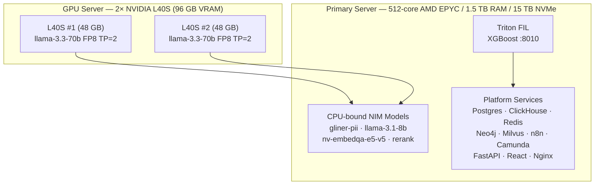

---

## 3. Architectural Overview

The platform is structured as seven discrete layers. Each layer depends only on the layers below it, enabling independent scaling and replacement of components.

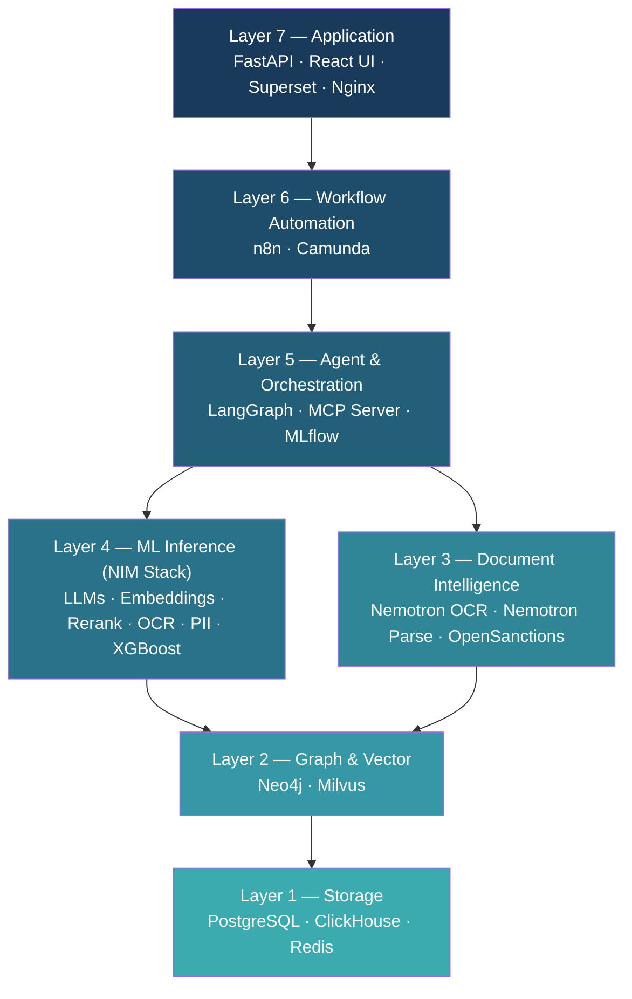

---

## 4. Layer 1 — Storage Layer

The storage layer provides durable, queryable persistence for all platform data. Three engines serve distinct access patterns:

- **PostgreSQL** — transactional records: cases, alerts, audit logs, user state
- **ClickHouse** — high-throughput analytical queries over transaction history and time-series signals
- **Redis** — low-latency caching, session state, and pub/sub messaging between services

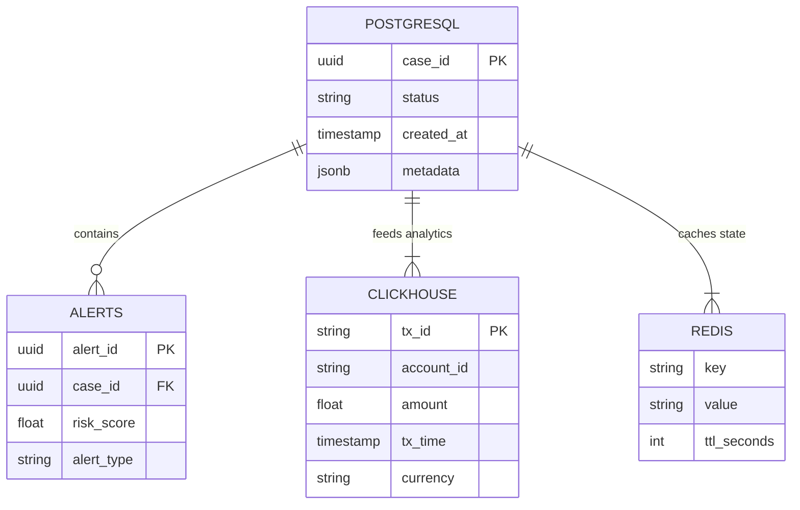

---

## 5. Layer 2 — Graph & Vector Layer

This layer provides two specialized data structures that are central to AML intelligence:

- **Neo4j** — stores the entity relationship graph: accounts, persons, companies, transactions, and ownership chains. Graph traversal enables detection of layering schemes, shell company networks, and unusual transaction patterns.
- **Milvus** — stores dense vector embeddings produced by the embedding NIM. Enables semantic similarity search over documents, entities, and transaction narratives.

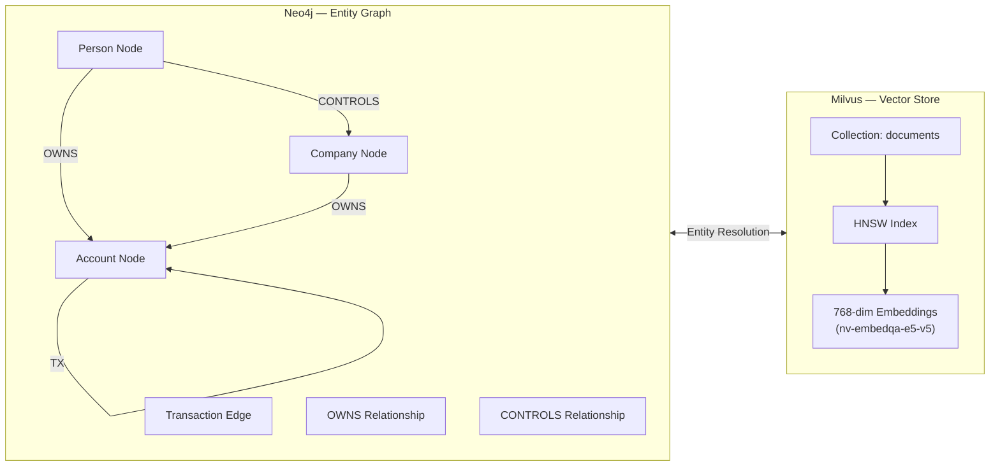

---

## 6. Layer 3 — Document Intelligence Layer

This layer handles ingestion and parsing of unstructured financial documents — statements, KYC forms, wire transfer records, sanctions lists.

- **nemotron-ocr-v1** (`:8021`) — GPU-powered OCR, replacing the legacy Apache Tika path
- **nemotron-parse** (`:8022`) — 885M VLM that understands document layout and structure; works in tandem with OCR v1
- **OpenSanctions** — reference data source providing up-to-date global sanctions, PEP, and watchlist data for entity screening

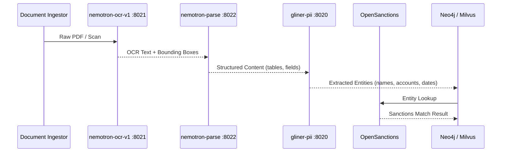

---

## 7. Layer 4 — ML Inference Layer (NIM Stack)

The inference layer is the computational core of the platform. All models are served via NVIDIA NIM containers, providing OpenAI-compatible APIs.

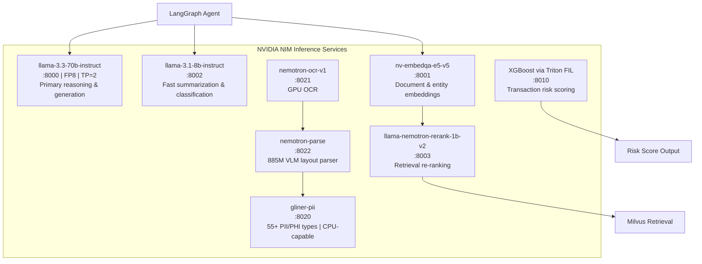

### Inference Routing Logic

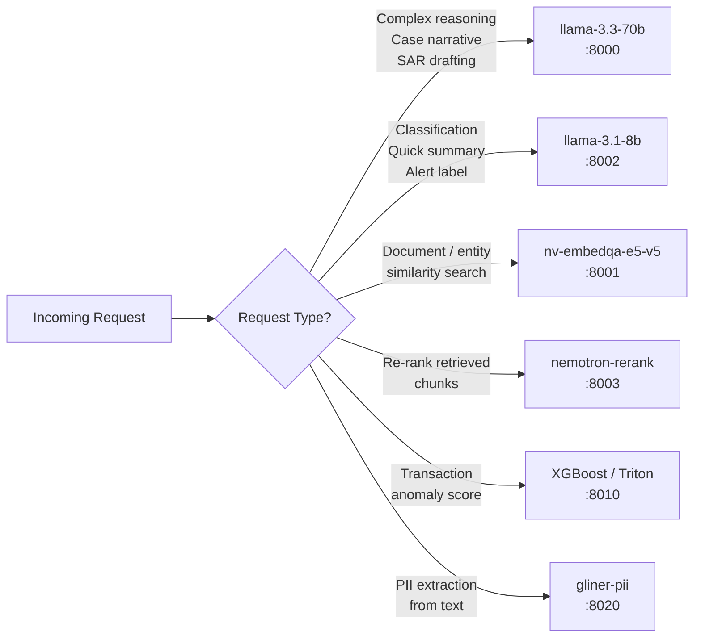

---

## 8. Layer 5 — Agent & Orchestration Layer

This layer provides the intelligence coordination infrastructure: agent reasoning loops, tool calling, experiment tracking, and external integration via MCP.

- **LangGraph** — stateful agent graphs managing multi-step AML investigations
- **MCP Server** — Model Context Protocol server exposing platform tools to LLM agents
- **MLflow** — experiment tracking, model registry, and inference artifact versioning

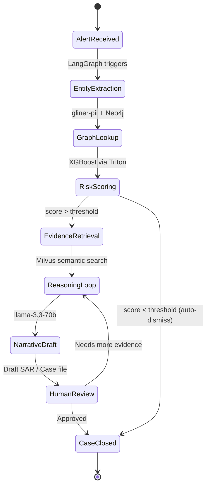

### MCP Tool Surface

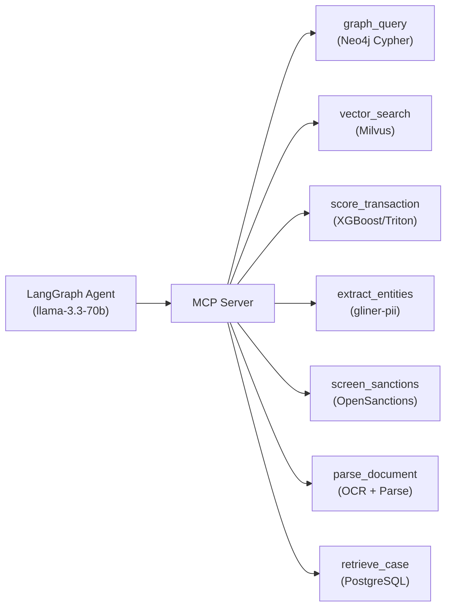

---

## 9. Layer 6 — Workflow Automation Layer

This layer handles business process automation and case lifecycle management, bridging the AI inference layer with human investigators.

- **n8n** — event-driven automation: alert routing, notification triggers, data enrichment pipelines, third-party integrations
- **Camunda** — BPMN-based case management for regulatory-compliant AML investigation workflows (STR/SAR filing, escalation paths, deadlines)

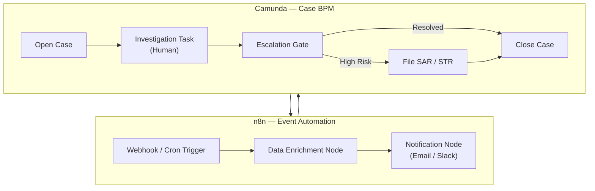

---

## 10. Layer 7 — Application Layer

The application layer exposes the platform to end users (analysts, compliance officers) and external systems.

- **FastAPI** — REST/WebSocket API gateway; routes requests to appropriate services
- **React UI** — investigator dashboard for case review, graph visualization, alert triage
- **Apache Superset** — BI dashboards for AML trend analysis, KPI monitoring, regulatory reporting
- **Nginx** — reverse proxy, TLS termination, load balancing

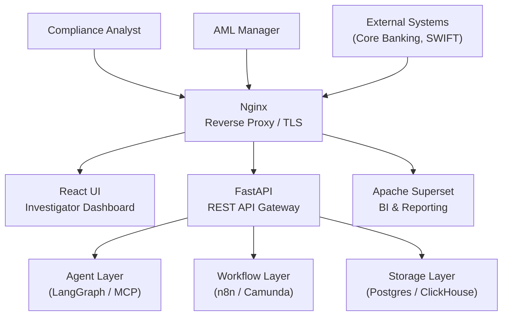

---

## 11. NIM Model Stack Reference

All models are locked and confirmed. This table is the authoritative configuration reference.

| Model | Port | Backend | Notes |
|---|---|---|---|
| `nim/meta/llama-3.3-70b-instruct` | 8000 | NIM Container | FP8 quantized, Tensor Parallel = 2 across both L40S |
| `nim/nvidia/nv-embedqa-e5-v5` | 8001 | NIM Container | Primary embedding model; multilingual upgrade tracked |
| `nim/meta/llama-3.1-8b-instruct` | 8002 | NIM Container | Fast inference for classification and summarization |
| `nim/nvidia/llama-nemotron-rerank-1b-v2` | 8003 | NIM Container only | Not in model registry — query via `ngc registry image list --org nim` |
| XGBoost | 8010 | Triton FIL Backend | Transaction anomaly scoring |
| `nim/nvidia/gliner-pii` | 8020 | NIM Container | 55+ PII/PHI entity types; CPU-capable (no GPU contention) |
| `nim/nvidia/nemotron-ocr-v1` | 8021 | NIM Container | Replaces Apache Tika OCR path |
| `nim/nvidia/nemotron-parse` | 8022 | NIM Container | 885M VLM; pairs with OCR v1 for structured parsing |

### GPU Memory Allocation

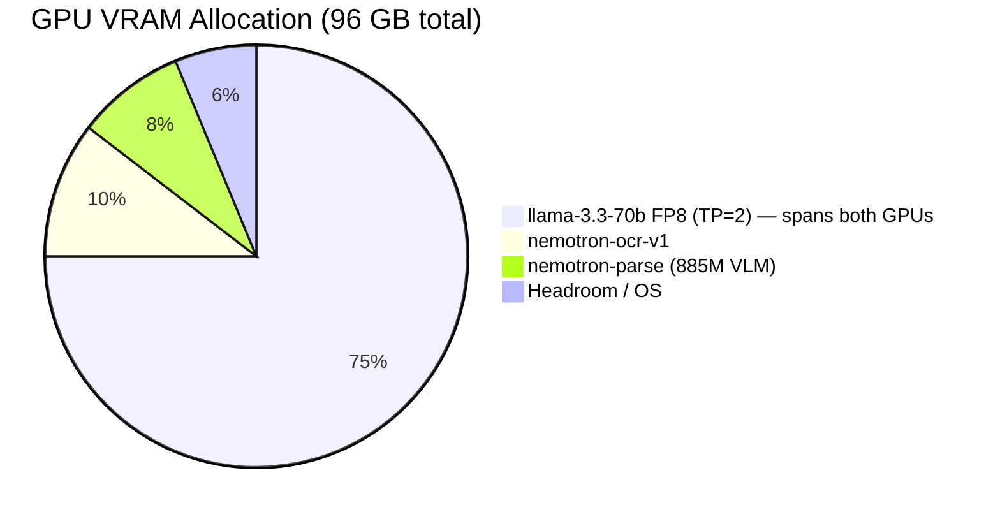

### NIM Dependency Note

> `llama-nemotron-rerank-1b-v2` exists **only as a NIM container image**, not as downloadable model weights. It must be discovered via:
> ```bash
> ngc registry image list --org nim
> ```
> Do **not** search `ngc registry model list` for this model.

---

## 12. Data Flow: End-to-End AML Pipeline

This diagram shows the complete flow from raw financial data ingestion to SAR filing.

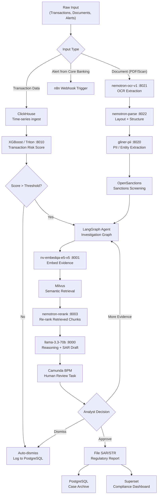

---

## 13. Service Port Map

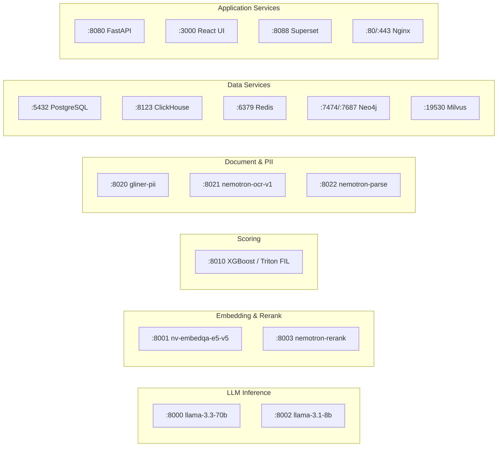

---

## 14. Key Design Decisions

### Why NVIDIA NIM?

NIM containers provide production-ready, optimized inference with OpenAI-compatible APIs. Using the full NVIDIA AI Enterprise catalog allows the platform to run OCR, PII extraction, embeddings, reranking, and LLM reasoning without managing custom model serving infrastructure.

### Why Tensor Parallelism = 2 for llama-3.3-70b?

The 70B model in FP8 requires ~70 GB VRAM. With TP=2, the model is sharded across both L40S GPUs (96 GB total), with headroom for the remaining NIM services.

### Why gliner-pii on CPU?

`gliner-pii` is CPU-capable, which deliberately avoids GPU contention with the inference models. Given the high-throughput PII extraction workload (every parsed document passes through it), keeping it CPU-bound preserves GPU resources for the heavier LLM and OCR workloads.

### Why nemotron-ocr-v1 over Tika?

Apache Tika provides reasonable text extraction for clean PDFs but degrades significantly on scanned documents, low-quality images, and handwritten text. `nemotron-ocr-v1` is GPU-accelerated and designed for financial documents. It integrates directly with `nemotron-parse` for structured layout extraction — a capability Tika does not provide.

### Multilingual Consideration

`llama-nemotron-embed-1b-v2` is being tracked as a potential replacement for `nv-embedqa-e5-v5` when non-English AML source documents (Arabic, French, Bangla, etc.) become a significant portion of the ingest pipeline.

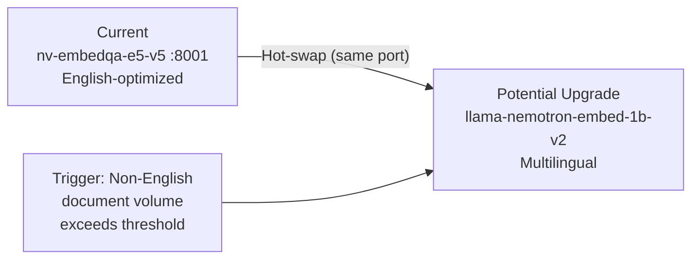

---

*Document generated for goAML-V2 platform — internal reference only.*
