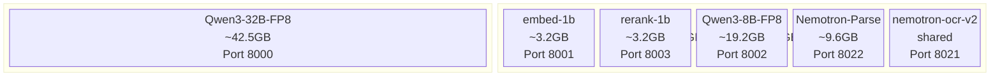
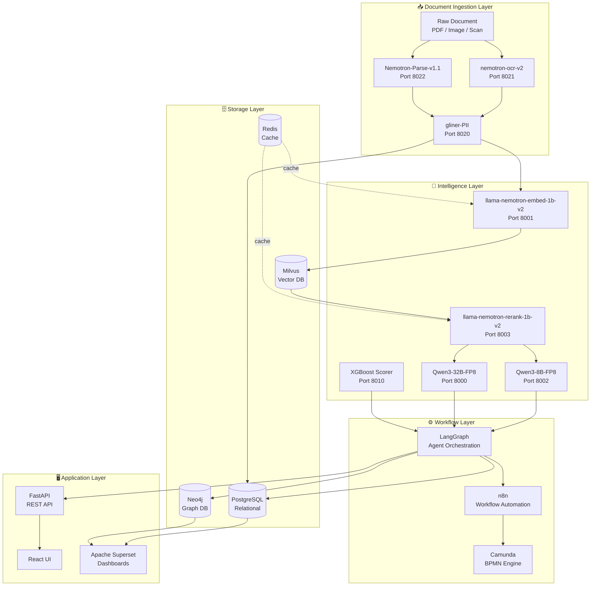
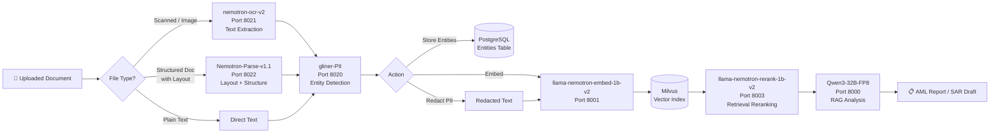
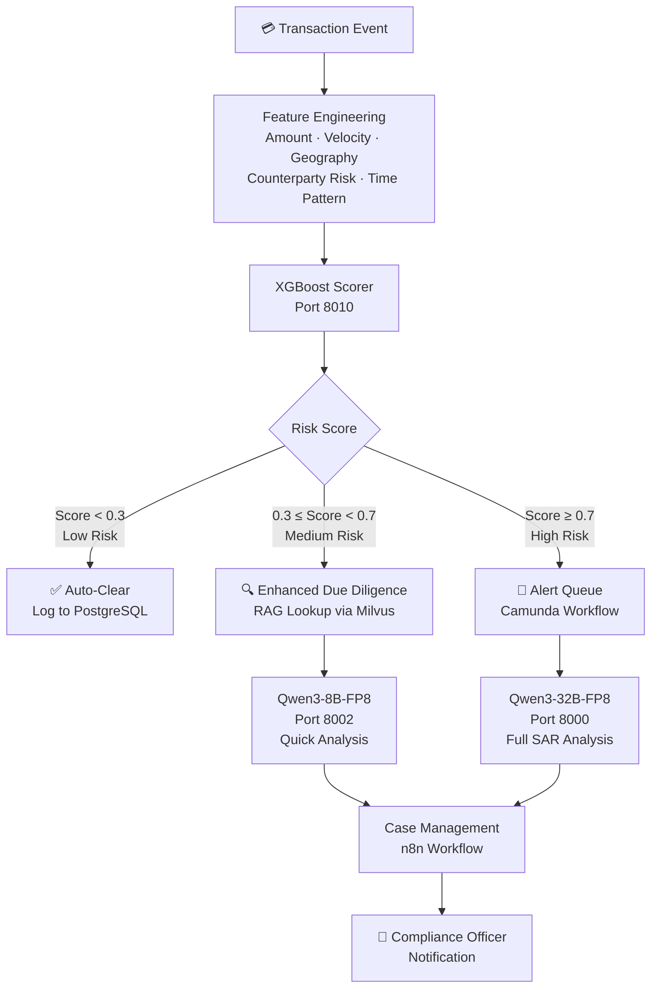
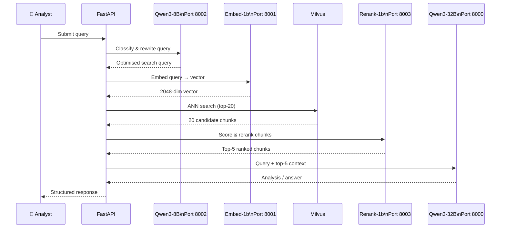
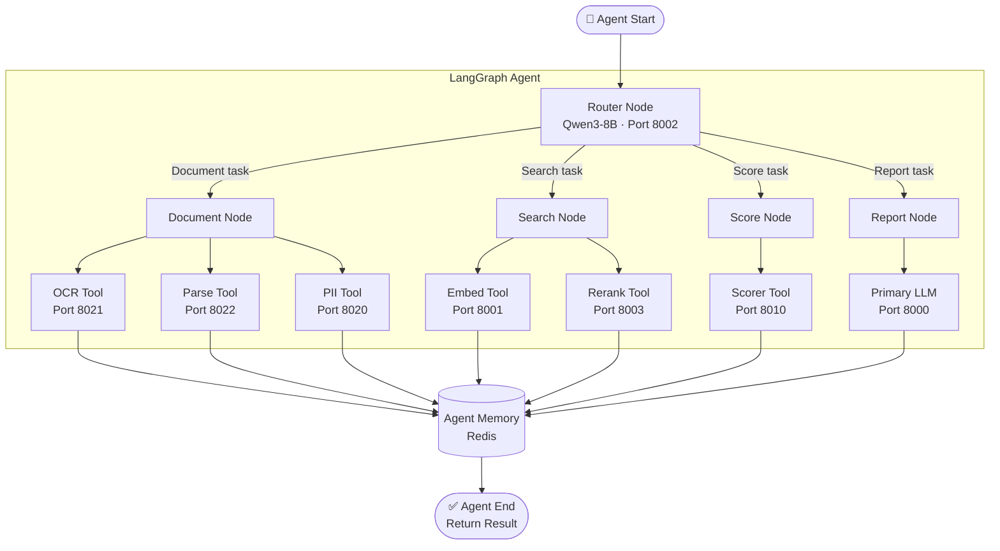
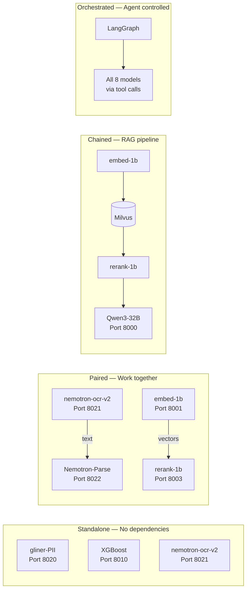

# goAML-V2 — Model Stack Reference

> **Platform:** AML (Anti-Money Laundering) Intelligence Platform  
> **Server:** gpu-01 · 2× NVIDIA L40S (48GB each, 96GB total)  
> **Last updated:** 2026-04-09

---

## Model Registry

| # | Container | Model | Port | Runtime | GPU | Purpose |
|---|---|---|---|---|---|---|
| 1 | `goaml-llm-primary` | `Qwen/Qwen3-32B-FP8` | 8000 | vLLM TP=1 FP8 | GPU 0 | Primary reasoning & analysis LLM |
| 2 | `goaml-embed` | `nvidia/llama-nemotron-embed-1b-v2` | 8001 | vLLM pooling | GPU 1 | Multilingual semantic embeddings |
| 3 | `goaml-llm-fast` | `Qwen/Qwen3-8B-FP8` | 8002 | vLLM FP8 | GPU 1 | Fast/lightweight LLM for routing & drafting |
| 4 | `goaml-rerank` | `nvidia/llama-nemotron-rerank-1b-v2` | 8003 | vLLM pooling | GPU 1 | Re-rank retrieved documents by relevance |
| 5 | `goaml-scorer` | XGBoost (placeholder) | 8010 | FastAPI / CPU | CPU | AML risk scoring — transaction features → probability |
| 6 | `goaml-pii` | `nvidia/gliner-PII` | 8020 | FastAPI / CPU | CPU | PII/PHI detection & redaction (55+ entity types) |
| 7 | `goaml-ocr` | `nvidia/nemotron-ocr-v2` | 8021 | FastAPI / GPU 1 | GPU 1 | Multilingual OCR — scanned docs → text |
| 8 | `goaml-parse` | `nvidia/NVIDIA-Nemotron-Parse-v1.1` | 8022 | vLLM multimodal | GPU 1 | Structured document parsing — images → markdown/JSON |

---

## Model Purposes

### 🧠 Qwen3-32B-FP8 — Primary LLM (Port 8000)
The core reasoning engine. Handles complex AML analysis tasks: SAR (Suspicious Activity Report) narrative generation, entity relationship reasoning, risk explanation, and multi-step agent planning. Thinking mode can be enabled per-request for deeper chain-of-thought on complex cases.

### ⚡ Qwen3-8B-FP8 — Fast LLM (Port 8002)
Lightweight companion to the 32B. Used for tasks that don't require deep reasoning: query classification, intent routing, short-form extraction, summarisation of already-structured data, and drafting simple outputs. Reduces load on the primary model.

### 🔢 llama-nemotron-embed-1b-v2 — Embeddings (Port 8001)
Converts text into 2048-dimensional semantic vectors. Multilingual — handles non-English AML source documents (Arabic, Chinese, French, etc.). Powers the vector search layer in Milvus for RAG retrieval, entity similarity matching, and document deduplication.

### 📊 llama-nemotron-rerank-1b-v2 — Reranker (Port 8003)
Given a query and a list of retrieved documents, scores each document for relevance and reorders them. Sits between Milvus retrieval and LLM context assembly — ensures the most relevant chunks are prioritised within the context window.

### 🔍 gliner-PII — PII Extractor (Port 8020)
Named-entity recognition model fine-tuned for 55+ PII/PHI entity types: persons, organisations, SSNs, account numbers, passport numbers, IP addresses, emails, and more. Runs on CPU. Used to redact sensitive data before storage and to extract structured entities from raw text.

### 📄 nemotron-ocr-v2 — OCR (Port 8021)
Multilingual OCR engine for scanned financial documents — bank statements, invoices, contracts, ID documents. Outputs clean text that feeds into the document intelligence pipeline. Replaces Apache Tika's OCR path.

### 🗂️ NVIDIA-Nemotron-Parse-v1.1 — Document Parser (Port 8022)
Vision-language model that understands document layout. Takes document images and produces structured markdown or JSON — preserving tables, headers, columns, and reading order. Works in tandem with nemotron-ocr-v2: OCR extracts text, Parse extracts structure.

### 🎯 XGBoost Scorer — Risk Scorer (Port 8010)
Gradient-boosted tree model for transaction-level AML risk scoring. Ingests engineered features (transaction amount, frequency, counterparty risk, geography, velocity) and outputs a fraud probability score (0–1). Placeholder until a trained model is available.

---

## Architecture Diagrams

### 1. GPU Memory Layout



---

### 2. Full Service Map



---

### 3. Document Intelligence Pipeline



---

### 4. Transaction Risk Scoring Pipeline



---

### 5. RAG (Retrieval-Augmented Generation) Flow



---

### 6. LangGraph Agent Architecture



---

### 7. Model Dependency Map



---

## Port Reference

| Port | Service | Protocol | Notes |
|------|---------|----------|-------|
| 8000 | Qwen3-32B-FP8 | OpenAI-compatible REST | `/v1/chat/completions` |
| 8001 | llama-nemotron-embed-1b-v2 | OpenAI-compatible REST | `/v1/embeddings` |
| 8002 | Qwen3-8B-FP8 | OpenAI-compatible REST | `/v1/chat/completions` |
| 8003 | llama-nemotron-rerank-1b-v2 | OpenAI-compatible REST | `/v1/rerank` |
| 8010 | XGBoost Scorer | FastAPI REST | `/score` · `/health` |
| 8020 | gliner-PII | FastAPI REST | `/extract` · `/health` |
| 8021 | nemotron-ocr-v2 | FastAPI REST | `/extract` · `/health` |
| 8022 | Nemotron-Parse-v1.1 | OpenAI-compatible REST | `/v1/completions` |

---

## Thinking Mode (Qwen3)

Both Qwen3 models support optional chain-of-thought reasoning. Disabled by default for speed.

```bash
# Enable thinking mode per-request
curl http://160.30.63.152:8000/v1/chat/completions \
  -H "Content-Type: application/json" \
  -d '{
    "model": "qwen3-32b-instruct",
    "extra_body": {"chat_template_kwargs": {"enable_thinking": true}},
    "messages": [{"role": "user", "content": "Analyse this transaction for AML risk..."}]
  }'
```

---

*goAML-V2 · gpu-01 · 160.30.63.152*
