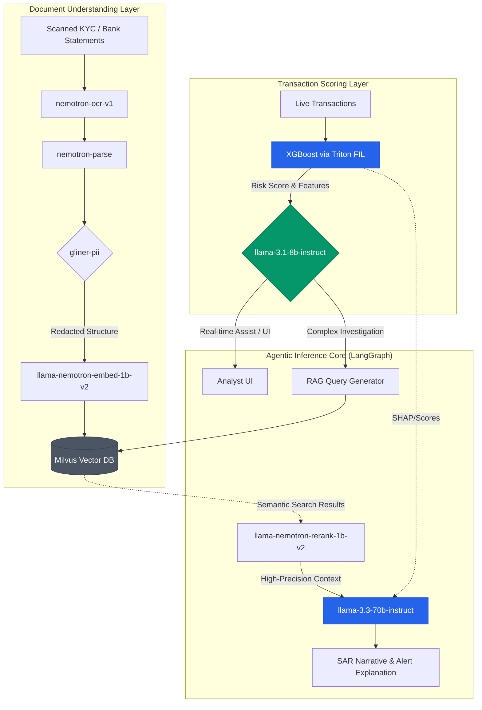

# AML Investigation AI Workflow

This artifact visualizes how the different NVIDIA Inference Microservices (NIMs) and machine learning models orchestrate an end-to-end Anti-Money Laundering (AML) and compliance workflow. 

## System Architecture

The AI workflow is broken down into concurrent layers that interact with your central LangGraph orchestrator:

> [!TIP]
> **Latency Strategy**
> Use the 8B model (`llama-3.1-8b-instruct`) for anything requiring immediate UI feedback (like triaging tags, autocomplete, or intent routing). Reserve the 70B model (`llama-3.3-70b-instruct`) for asynchronous batch tasks or deep investigation flows that generate final reports.

## Component Responsibilities

| Layer | Component | Role in Workflow |
| :--- | :--- | :--- |
| **Documents** | `nemotron-ocr-v1` & `parse` | Extracts structured data from messy, unstructured uploads (like poor-quality ID scans or nested tables in bank statements). |
| **Documents** | `gliner-pii` | Erases or masks sensitive customer data (SSNs, Names) *before* it gets embedded into the vector database, preventing massive privacy leaks. |
| **Scoring** | `XGBoost via Triton FIL` | Provides lightning-fast, highly deterministic risk scoring on raw tabular data (e.g., transaction frequencies, amounts, IP addresses). |
| **Knowledge** | `nemotron-embed-1b-v2` | Converts redacted documents and past case histories into multilingual vectors, enabling robust search across languages (e.g., Bengali, Arabic). |
| **Knowledge** | `nemotron-rerank-1b-v2` | Acts as the "filter" for the 70B model, re-ordering Milvus search results to ensure only the most relevant snippets consume context space. |
| **Reasoning** | `llama-3.1-8b-instruct` | The "Router". Determines user intent, handles simple queries, and delegates massive analytical tasks to the 70B model. |
| **Reasoning** | `llama-3.3-70b-instruct` | The "Analyst". Synthesizes XGBoost scores, Milvus queries, and document parses to write comprehensive, auditor-ready Suspicious Activity Reports (SARs). |
