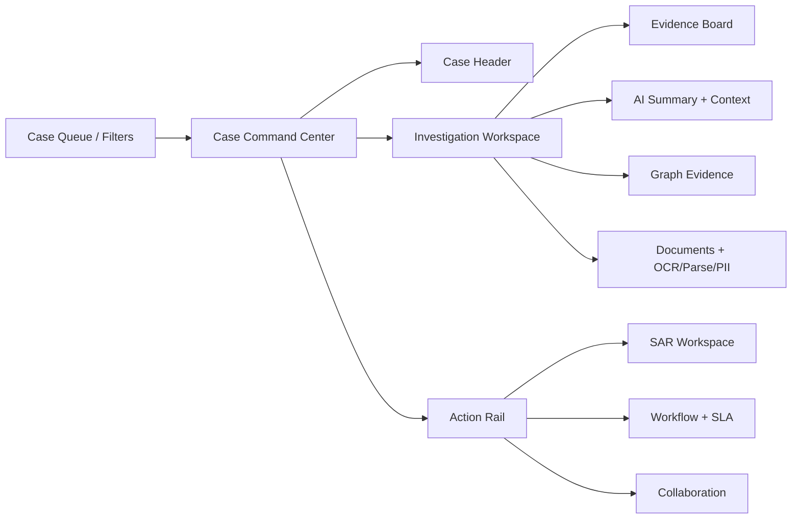
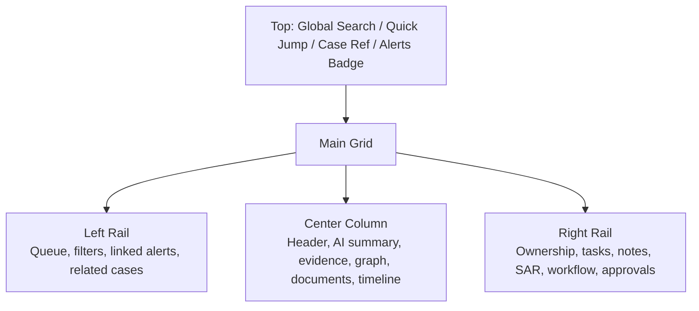
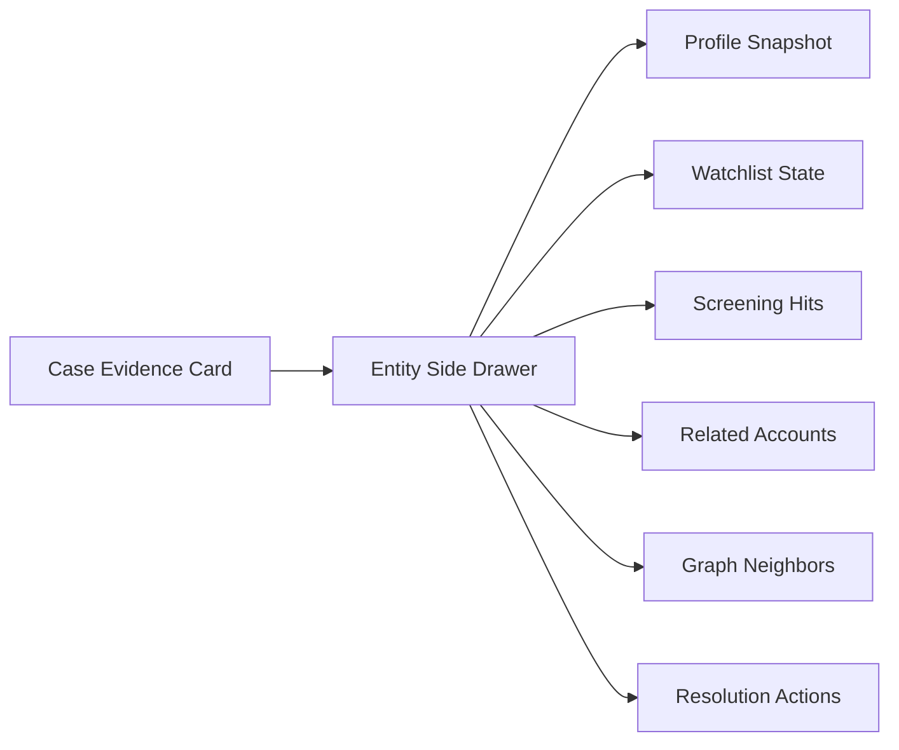
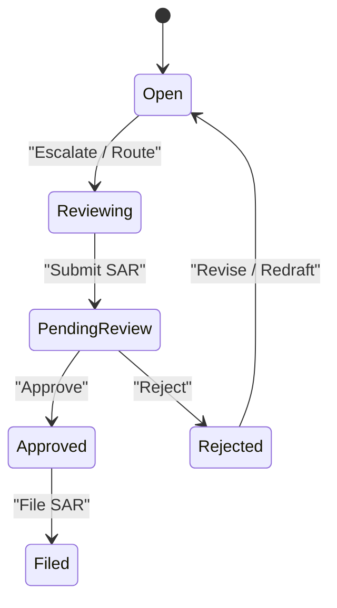

# goAML v2 Case Command Center Design Spec

## 1. Purpose

The Case Command Center is the next-generation analyst workspace for goAML v2. Its job is to unify the investigation, collaboration, workflow, and filing experience into one case-first screen so analysts do not need to jump between `Cases & SARs`, `Documents`, `Network Graph`, `SAR Review Queue`, `Watchlist Dashboard`, `Workflow Ops`, `n8n Monitor`, and `Camunda` to do routine work.

This is not a net-new capability layer. It is a consolidation layer over features that are already live:

- case timeline and case updates
- alert investigation and escalation
- SAR drafting, review, approval, rejection, and filing
- AI-generated case summaries and investigation context
- graph evidence, drilldown, and pathfinding
- direct document attachment and analysis
- collaboration notes and tasks
- workflow routing, SLA tracking, and orchestration state

The goal is to make goAML v2 feel like one investigation product instead of a set of strong but separate workspaces.

## 2. Design Goals

1. Give an analyst everything needed to work a case without leaving the case screen.
2. Surface the most important decisions first: risk, evidence, ownership, next action.
3. Keep the layout explainable to compliance users, not just engineers.
4. Treat workflow and governance as first-class, not hidden behind drawers.
5. Preserve room for WSO2 identity, RBAC, and formal approval lanes later.

## 3. Non-Goals

- Replacing the specialist dashboards entirely.
- Hiding underlying workflow complexity from operations teams.
- Designing around a future auth system that is not live yet.
- Building a separate React app before proving the information architecture.

## 4. Users

### Primary users

- Level 1 analysts triaging suspicious activity.
- Level 2 investigators assembling evidence and narratives.
- SAR reviewers and approvers managing governance.

### Secondary users

- AML operations leads monitoring SLA risk and queue pressure.
- Watchlist investigators reviewing escalations.
- Demo and implementation teams showing the platform end to end.

## 5. Current-State Inputs Already Available

The command center can be built on top of live APIs and live workflows already running on `160.30.63.131`.

### Existing case data and actions

- `GET /api/v1/cases`
- `GET /api/v1/cases/{case_id}`
- `PATCH /api/v1/cases/{case_id}`
- `GET /api/v1/cases/{case_id}/events`
- `POST /api/v1/cases/{case_id}/summary`
- `GET /api/v1/cases/{case_id}/context`
- `POST /api/v1/cases/{case_id}/notes`
- `POST /api/v1/cases/{case_id}/tasks`
- `PATCH /api/v1/cases/{case_id}/tasks/{task_id}`

### Existing SAR actions

- `POST /api/v1/cases/{case_id}/sar`
- `GET /api/v1/cases/{case_id}/sar`
- `POST /api/v1/cases/{case_id}/sar/review`
- `POST /api/v1/cases/{case_id}/sar/file`

### Existing document actions

- `POST /api/v1/cases/{case_id}/documents/analyze`
- `POST /api/v1/cases/{case_id}/documents/{document_id}/attach`
- `GET /api/v1/documents`
- `GET /api/v1/documents/{document_id}`

### Existing graph actions

- `POST /api/v1/graph/explore`
- `POST /api/v1/graph/drilldown`
- `POST /api/v1/graph/pathfind`

### Existing workflow visibility

- `GET /api/v1/workflow/overview`
- `GET /api/v1/workflow/n8n`
- `GET /api/v1/workflow/camunda`

## 6. Product Positioning

### Today

The current UI already has most of the needed ingredients, but they are spread across:

- `Cases & SARs`
- `Network Graph`
- `Documents`
- `SAR Review Queue`
- `Watchlist Dashboard`
- `Workflow Ops`
- `n8n Monitor`
- `Camunda`

### Next-state

The Case Command Center becomes the default case workspace. Other pages remain, but mostly as specialist or bulk-operation views.

## 7. Core Screen Model

The screen should use a three-zone layout on desktop:

- left rail: case navigation and queue context
- center workspace: investigation and evidence
- right rail: actions, workflow state, collaboration, and governance

On tablet/mobile, these become stacked tabs.

## 8. Desktop Layout

### 8.1 Left rail

Purpose: keep investigators anchored in queue and case context without leaving the case view.

Contains:

- queue selector: `My cases`, `Team queue`, `Review`, `Approval`, `Watchlist-linked`
- quick filters: `critical`, `SLA breached`, `pending review`, `new documents`
- compact linked alert list
- compact related cases list
- quick jump to next/previous case

### 8.2 Center column

Purpose: support investigation and evidence assembly.

Contains:

- case header
- AI summary
- investigation context
- evidence board
- graph evidence and pathfinding
- document workspace
- timeline

### 8.3 Right rail

Purpose: let the user act, assign, collaborate, and move the case forward.

Contains:

- ownership and routing
- action rail
- SAR governance state
- collaboration notes
- tasks
- workflow state

## 9. Command Center Sections

## 9.1 Case Header

### Content

- case ref
- status
- priority
- assigned analyst
- routed team
- routed region
- created date
- linked SAR status
- SLA state
- Camunda task badge

### Why it matters

The header should answer three questions instantly:

1. What is this case?
2. How urgent is it?
3. Who owns the next move?

### UI behavior

- show colored risk and SLA badges
- allow inline assignment and status update
- show open linked alert count and document count
- show `Open graph` and `Open workflow` shortcuts

## 9.2 Investigation Summary

### Content

- AI-generated case summary
- top risk factors
- latest screening snapshot
- last summary generation timestamp
- summary confidence or evidence count banner

### Existing data sources

- `POST /api/v1/cases/{case_id}/summary`
- `GET /api/v1/cases/{case_id}/context`
- `GET /api/v1/cases/{case_id}`

### Actions

- `Generate AI Summary`
- `Refresh with latest evidence`
- `Pin to SAR narrative workspace`

## 9.3 Evidence Board

This is the heart of the command center.

### Subsections

- alerts
- transactions
- documents
- screening hits
- graph findings
- derived AI evidence

### Expected experience

Each evidence item should act like a card:

- title
- type badge
- importance indicator
- why it matters
- click-through actions

### Recommended layout

- top row: `Alerts`, `Transactions`, `Screening`
- second row: `Documents`, `Graph Findings`

### Smart actions

- `open detail`
- `add analyst note`
- `attach to SAR`
- `open in graph`
- `mark as key evidence`

## 9.4 Graph Evidence Panel

This should build directly on the graph features already live.

### Content

- relationship evidence
- counterparty drilldown
- pathfinding target search
- suspicious relationship summaries

### Design additions

- show a `Why this connection matters` line for each relationship
- allow one-click pivot:
  - from case to entity
  - from entity to account
  - from alert to transaction
  - from transaction to document

### Existing live capabilities to reuse

- relationship evidence rendering
- graph drilldown
- graph pathfinding
- open graph workspace shortcut

## 9.5 Document Intelligence Panel

### Content

- direct case documents
- semantically retrieved related documents
- OCR/Parse/PII badges
- vector index status
- file storage reference

### Actions

- `Attach & Analyze`
- `Open detail`
- `Mark as key evidence`
- `Open graph`
- `Re-run OCR`
- `Re-run Parse`

### UX note

Documents should be split into two tabs:

- `Attached Evidence`
- `Related by Retrieval`

That keeps explicit evidence separate from AI-discovered supporting material.

## 9.6 Action Rail

This is the primary decision strip for analysts.

### Actions to keep visible

- update case status
- assign analyst
- escalate
- add note
- create task
- generate AI summary
- draft SAR
- submit for review
- approve
- reject
- file SAR

### Rule

The rail should only show actions that are valid for the current case state.

Examples:

- do not show `File SAR` as primary when SAR is still `draft`
- show `Submit for review` when draft exists
- show `Approve` and `Reject` in review state

## 9.7 Workflow State Panel

### Content

- SLA age and breach status
- routing info
- current Camunda process name
- current Camunda user task
- notification history
- last n8n automation touchpoint

### Why it matters

This is where the compliance and operations story becomes visible. Analysts should understand not only the case evidence, but also where the case sits in formal workflow.

### Data sources

- case metadata routing
- case events
- workflow overview
- camunda dashboard

## 9.8 Team Collaboration Panel

### Content

- notes stream
- open tasks
- completed tasks
- blocked tasks
- recent handoffs

### Design change from current UI

Today, notes and tasks are already available. In the command center, this panel should become persistent and easier to scan:

- left tab: notes
- right tab: tasks
- each task card shows assignee, priority, and age

## 9.9 SAR Workspace

This panel should become more editorial and less button-only.

### Content

- draft narrative preview
- filing readiness checklist
- reviewer note
- approver note
- filing reference
- workflow state badges

### Actions

- draft
- submit
- approve
- reject
- file

### Enhancement

Allow toggling between:

- `Narrative Preview`
- `Workflow`
- `Evidence Included`

This will help reviewers understand what supports the filing.

## 9.10 Timeline

The timeline remains the audit spine.

### Include

- case created/updated
- alert actions
- document uploads and attachments
- AI summary generation
- SAR transitions
- workflow routing
- SLA notifications
- Camunda transitions
- watchlist escalations
- analyst notes and task changes

### Improvement

Add filter chips:

- `All`
- `Evidence`
- `Workflow`
- `Collaboration`
- `SAR`

## 10. Entity and Counterparty Side Drawer

The command center should support lightweight entity pivoting without leaving the case.

When a user clicks a linked entity, counterparty, or account:

- open a right-side overlay drawer
- show summary, watchlist state, screening hits, related accounts, graph neighbors, and linked cases

This avoids full page navigation for common drilldown.

## 11. Interaction Flows

## 11.1 Standard investigation flow

1. Analyst opens case from queue.
2. Header shows urgency, ownership, routing, and workflow state.
3. AI summary and risk factors load.
4. Analyst reviews alerts, transactions, documents, and graph evidence.
5. Analyst adds notes and tasks.
6. Analyst drafts or advances SAR.

## 11.2 Reviewer flow

1. Reviewer opens case from review queue.
2. Focus lands on SAR workspace and filing readiness.
3. Reviewer checks evidence board and timeline.
4. Reviewer adds approval or rejection note.
5. Workflow panel updates Camunda task and SLA state.

## 11.3 Escalation flow

1. Watchlist re-screen or alert escalation raises priority.
2. Routing metadata updates ownership and region/team.
3. Workflow panel shows escalation process/task.
4. Case header and queue badges update immediately.

## 12. State Model

The screen should explicitly model the case as a composition of sub-states:

- case status
- SLA status
- assignment state
- investigation completeness
- SAR workflow state
- workflow orchestration state
- collaboration activity state

## 13. Information Architecture Recommendation

The command center should become the new default click target for:

- case list rows
- SAR review queue rows
- watchlist-linked case rows
- alert `Investigate` actions

The following pages remain:

- `Network Graph`: large-scale graph exploration
- `Documents`: bulk document operations
- `Workflow Ops`: ops and observability
- `n8n Monitor`: automation inventory
- `Camunda`: orchestration monitoring

## 14. API Mapping

| Panel | Existing endpoint(s) | Notes |
| --- | --- | --- |
| Case header | `/api/v1/cases/{id}` | already live |
| Timeline | `/api/v1/cases/{id}/events` | already live |
| AI summary | `/api/v1/cases/{id}/summary`, `/api/v1/cases/{id}` | already live |
| Context | `/api/v1/cases/{id}/context` | already live |
| Notes | `/api/v1/cases/{id}/notes` | already live |
| Tasks | `/api/v1/cases/{id}/tasks`, `/api/v1/cases/{id}/tasks/{task_id}` | already live |
| SAR workspace | `/api/v1/cases/{id}/sar`, `/review`, `/file` | already live |
| Documents | `/api/v1/cases/{id}/documents/analyze`, `/attach` | already live |
| Graph | `/api/v1/graph/drilldown`, `/pathfind`, `/explore` | already live |
| Workflow state | `/api/v1/workflow/overview`, `/camunda` | already live |

## 15. New API Additions Recommended

The first version can reuse current endpoints. The second version will be cleaner if we add:

- `GET /api/v1/cases/{case_id}/workspace`
  Returns the complete composed view model for the command center.
- `GET /api/v1/cases/{case_id}/workflow`
  Returns case-specific workflow state, notifications, and orchestration detail.
- `POST /api/v1/cases/{case_id}/evidence/{evidence_id}/pin`
  Marks evidence as key filing support.
- `POST /api/v1/cases/{case_id}/documents/{document_id}/reanalyze`
  Supports manual OCR/Parse reruns.
- `GET /api/v1/cases/{case_id}/filing-readiness`
  Computes filing readiness gaps explicitly.

## 16. Visual Direction

### Tone

- serious
- operational
- confidence-building
- not flashy

### Visual rules

- use dense but readable cards
- reserve strong colors for urgency, risk, and blocked states
- keep governance states highly legible
- use clear typographic hierarchy to separate facts from actions

### Badge system

- red: critical / breached / blocked
- amber: needs review / due soon
- blue: investigation state / assigned
- purple: SAR / filing / workflow
- green: completed / filed / cleared

## 17. Responsive Behavior

### Desktop

- full three-column layout

### Tablet

- collapse right rail into tabs:
  - `Actions`
  - `SAR`
  - `Workflow`
  - `Collaboration`

### Mobile

- use stacked accordions
- keep header sticky
- keep action rail as bottom sheet

## 18. Accessibility and Usability

- keyboard-accessible queue navigation
- timeline filters with large tap targets
- always-visible labels for status and SLA
- do not rely on color alone for urgency
- preserve a readable audit trail export path later

## 19. Phased Delivery Plan

## Phase A: IA consolidation

Goal: unify current case detail into one stable command center shell.

Deliver:

- new case header
- persistent right rail
- evidence board regrouping
- integrated workflow panel

## Phase B: evidence-first workflow

Goal: make evidence review the primary center-column experience.

Deliver:

- attached vs retrieved document tabs
- graph evidence improvements
- key evidence pinning
- SAR evidence inclusion preview

## Phase C: reviewer-grade governance

Goal: make formal review and approval clean and predictable.

Deliver:

- richer SAR workspace
- filing readiness checklist
- reviewer note vs approver note separation
- case-specific workflow detail panel

## Phase D: productivity upgrades

Goal: reduce clicks and context switching.

Deliver:

- entity side drawer
- keyboard shortcuts
- quick action palette
- workspace endpoint for faster load

## 20. Suggested Implementation Order

1. Build a `case command center` page shell that reuses current case detail data.
2. Move header, AI summary, notes, tasks, SAR, and timeline into the new layout.
3. Fold graph evidence and documents into the evidence board.
4. Add workflow panel with Camunda and SLA state.
5. Add entity side drawer.
6. Add key evidence pinning and filing-readiness UX.

## 21. Acceptance Criteria

The first release of the Case Command Center is successful if:

- an analyst can investigate, collaborate, and submit a SAR without leaving the case page
- a reviewer can approve or reject from the same screen
- graph evidence and document evidence are visible without separate page jumps
- routing, SLA, and orchestration states are readable at a glance
- average clicks to complete a standard case review are lower than in the current UI

## 22. Open Questions

- Should the command center replace the current `Cases & SARs` page immediately, or launch behind a feature flag?
- Should reviewer and approver actions be visually separated even before WSO2 roles are live?
- Should pinned evidence affect AI summary and SAR generation prompt composition automatically?
- Do we want a formal `case completeness` score in the header?

## 23. Recommendation

Build the Case Command Center as the next UI layer, not as a redesign detour.

The backend and workflow groundwork is already strong enough that this is now mostly an information architecture and interaction design job. If we implement it carefully, it becomes the place where all the recent platform work finally feels unified.
