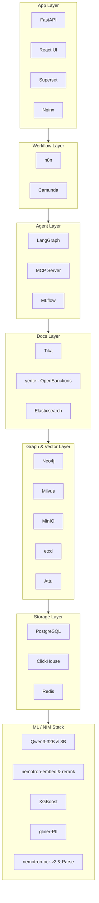
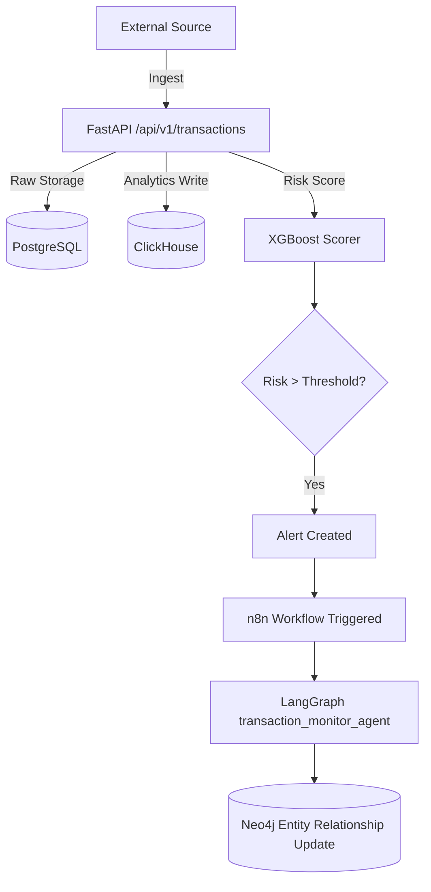
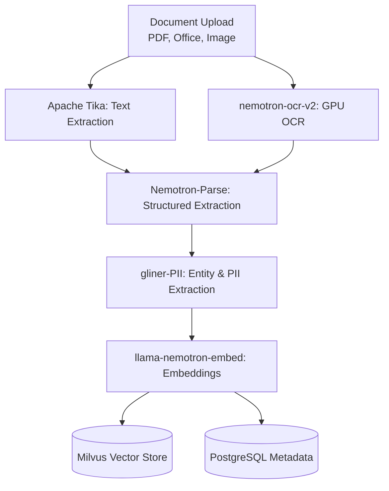
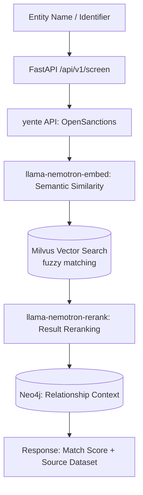
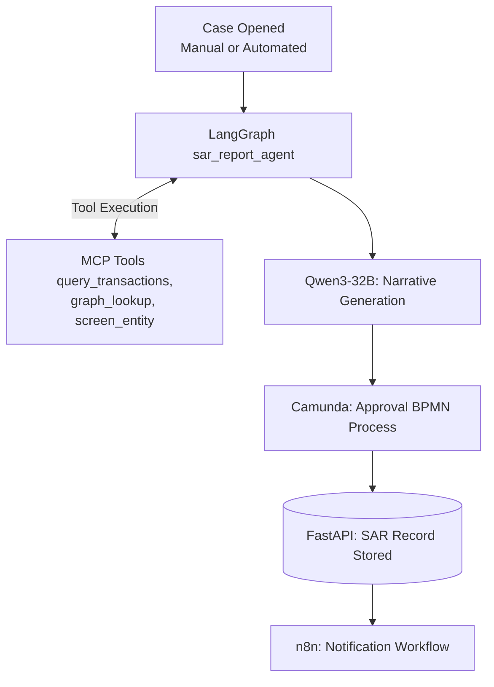

# goAML-V2 — AML Intelligence Platform

> Anti-Money Laundering intelligence platform built on a multi-service architecture integrating ML inference, document intelligence, graph analytics, and workflow automation for financial crime detection.

---

## Table of Contents

1. [Project Overview](#1-project-overview)
2. [Infrastructure](#2-infrastructure)
3. [Architecture](#3-architecture)
4. [ML / NIM Stack](#4-ml--nim-stack)
5. [Service Layers](#5-service-layers)
6. [Port Reference](#6-port-reference)
7. [Docker Deployment](#7-docker-deployment)
8. [Environment Variables](#8-environment-variables)
9. [Data Flow](#9-data-flow)
10. [API Reference](#10-api-reference)
11. [Roadmap](#11-roadmap)

---

## 1. Project Overview

goAML-V2 is a self-hosted, GPU-accelerated AML intelligence platform designed for financial crime detection, entity screening, and SAR (Suspicious Activity Report) generation. It replaces legacy rule-based systems with a hybrid ML + LLM architecture capable of:

- Real-time transaction risk scoring via XGBoost
- Semantic document search using transformer embeddings
- Entity resolution and network graph analysis
- Sanctions and PEP screening against 46+ global datasets
- Automated SAR narrative drafting using Qwen3-32B
- BPMN-driven case management and workflow automation
- PII extraction and redaction from financial documents
- GPU-accelerated OCR for unstructured document ingestion

---

## 2. Infrastructure

### Primary Server
| Component | Specification |
|---|---|
| CPU | AMD EPYC — 512 cores |
| RAM | 1.5 TB |
| Storage | 15 TB NVMe |
| OS | Ubuntu 24.04 |

### GPU Server
| Component | Specification |
|---|---|
| GPU 0 | NVIDIA L40S — 48 GB VRAM |
| GPU 1 | NVIDIA L40S — 48 GB VRAM |
| Total VRAM | 96 GB |
| Access | NVIDIA AI Enterprise |

### Project Path
```
/home/ze/dashboard-aml
```

---

## 3. Architecture

The platform is organized into 7 architectural layers, each deployed as an independent Docker Compose stack sharing a single external Docker network (`goaml-network`).



---

## 4. ML / NIM Stack

All 8 ML services are deployed and running. GPU assignment is optimized to avoid VRAM contention.

| Container | Model | Port | Runtime | GPU | Purpose |
|---|---|---|---|---|---|
| `goaml-llm-primary` | Qwen3-32B-FP8 | 8000 | vLLM | GPU 0 | SAR drafting, complex reasoning, case analysis |
| `goaml-embed` | llama-nemotron-embed-1b-v2 | 8001 | vLLM | GPU 1 | Document & entity embeddings, semantic search |
| `goaml-llm-fast` | Qwen3-8B-FP8 | 8002 | vLLM | GPU 1 | Alert classification, routing, quick inference |
| `goaml-rerank` | llama-nemotron-rerank-1b-v2 | 8003 | vLLM | GPU 1 | Search result reranking |
| `goaml-scorer` | XGBoost (placeholder) | 8010 | FastAPI | CPU | Transaction risk scoring |
| `goaml-pii` | nvidia/gliner-PII | 8020 | FastAPI | CPU | PII/PHI extraction — 55+ entity types |
| `goaml-ocr` | nvidia/nemotron-ocr-v2 | 8021 | FastAPI | GPU 1 | Document OCR — replaces Tika OCR path |
| `goaml-parse` | NVIDIA-Nemotron-Parse-v1.1 | 8022 | vLLM | GPU 1 | Structured document parsing |

### Base URLs (internal Docker network)
```python
LLM_PRIMARY  = "http://goaml-llm-primary:8000/v1"   # OpenAI-compatible
LLM_FAST     = "http://goaml-llm-fast:8002/v1"       # OpenAI-compatible
EMBED_URL    = "http://goaml-embed:8001/v1"           # OpenAI-compatible
RERANK_URL   = "http://goaml-rerank:8003/v1"          # OpenAI-compatible
SCORER_URL   = "http://goaml-scorer:8010"
PII_URL      = "http://goaml-pii:8020"
OCR_URL      = "http://goaml-ocr:8021"
PARSE_URL    = "http://goaml-parse:8022/v1"
```

---

## 5. Service Layers

### 5.1 Storage Layer
| Service | Image | Port | Purpose |
|---|---|---|---|
| `goaml-postgres` | postgres:16 | 5432 | Primary relational store — transactions, cases, alerts, users |
| `goaml-clickhouse` | clickhouse/clickhouse-server:24.3 | 8123 / 9000 | Time-series analytics — transaction volume, risk trends |
| `goaml-redis` | redis:7.2-alpine | 6379 | Caching, pub/sub, queue backend for n8n |

**Databases in PostgreSQL:**
- `goaml` — main application database (transactions, alerts, cases, entities)
- `superset` — Apache Superset metadata (isolated to avoid migration conflicts)

### 5.2 Graph + Vector Layer
| Service | Image | Port | Purpose |
|---|---|---|---|
| `goaml-neo4j` | neo4j:5.18-community | 7474 / 7687 | Entity relationship graph — accounts, persons, companies |
| `goaml-milvus` | milvusdb/milvus:v2.4.9 | 19530 / 9091 | Vector store — document and entity embeddings |
| `goaml-minio` | minio/minio | 9001 / 9002 | Object storage — Milvus backend, MLflow artifacts |
| `goaml-etcd` | quay.io/coreos/etcd:v3.5.14 | 2379 | Milvus metadata store |
| `goaml-attu` | zilliz/attu:v2.4 | 8080 | Milvus web UI |

Neo4j plugins installed: **APOC** + **Graph Data Science** — both required for entity resolution and network centrality analysis.

### 5.3 Docs Layer
| Service | Image | Port | Purpose |
|---|---|---|---|
| `goaml-tika` | apache/tika:3.3.0.0-full | 9998 | Document text extraction (PDF, Office, etc.) |
| `goaml-yente` | ghcr.io/opensanctions/yente:latest | 8383 | OpenSanctions screening API — 46+ datasets |
| `goaml-elasticsearch` | elasticsearch:8.13.4 | 9200 | yente search backend |

Document ingestion pipeline: `Tika → nemotron-ocr-v2 → Nemotron-Parse → Milvus`

### 5.4 Agent Layer
| Service | Image | Port | Purpose |
|---|---|---|---|
| `goaml-mlflow` | goaml-mlflow:latest | 5000 | ML experiment tracking, model registry |
| `goaml-langgraph` | goaml-langgraph:latest | 8100 | AML agent workflow runtime |
| `goaml-mcp-server` | goaml-mcp-server:latest | 8200 | Model Context Protocol — tool access for agents |

MLflow backend: PostgreSQL (`goaml` db) + MinIO (`mlflow-artifacts` bucket).

Planned LangGraph agents:
- `aml_screening_agent` — entity screening orchestration
- `transaction_monitor_agent` — real-time risk analysis
- `entity_resolution_agent` — cross-source entity deduplication
- `sar_report_agent` — automated SAR narrative drafting

MCP tools exposed:
- `query_transactions` — PostgreSQL AML records
- `screen_entity` — yente sanctions lookup
- `graph_lookup` — Neo4j relationship traversal
- `vector_search` — Milvus semantic search
- `get_risk_score` — XGBoost scoring

### 5.5 Workflow Layer
| Service | Image | Port | Purpose |
|---|---|---|---|
| `goaml-n8n` | n8nio/n8n:1.44.1 | 5678 | Workflow automation — alert triggers, notifications |
| `goaml-n8n-worker` | n8nio/n8n:1.44.1 | — | Queue worker — parallel workflow execution |
| `goaml-camunda` | camunda/camunda-bpm-platform:run-latest | 8085 | BPMN engine — case lifecycle, SAR approval flows |

n8n runs in queue mode with Redis as the message broker. Camunda handles long-running case management processes with audit trails.

### 5.6 App Layer
| Service | Image | Port | Purpose |
|---|---|---|---|
| `goaml-fastapi` | goaml-fastapi:latest | 8000 | REST API backend |
| `goaml-react-ui` | goaml-react-ui:latest | 3000 | AML dashboard frontend |
| `goaml-superset` | goaml-superset:latest | 8088 | Analytics dashboards |
| `goaml-nginx` | nginx:1.27-alpine | 80 | Reverse proxy — unified entry point |

**Nginx routing:**
| Path | Service |
|---|---|
| `/` | React UI |
| `/api/` | FastAPI |
| `/docs` | FastAPI Swagger |
| `/superset/` | Apache Superset |
| `/mlflow/` | MLflow UI |
| `/n8n/` | n8n workflows |

---

## 6. Port Reference

| Port | Service | Protocol |
|---|---|---|
| 80 | Nginx (reverse proxy) | HTTP |
| 3000 | React UI | HTTP |
| 5000 | MLflow | HTTP |
| 5432 | PostgreSQL | TCP |
| 5678 | n8n | HTTP |
| 6379 | Redis | TCP |
| 7474 | Neo4j Browser | HTTP |
| 7687 | Neo4j Bolt | TCP |
| 8000 | FastAPI / Qwen3-32B | HTTP |
| 8001 | llama-nemotron-embed | HTTP |
| 8002 | Qwen3-8B | HTTP |
| 8003 | llama-nemotron-rerank | HTTP |
| 8010 | XGBoost scorer | HTTP |
| 8020 | gliner-PII | HTTP |
| 8021 | nemotron-ocr-v2 | HTTP |
| 8022 | Nemotron-Parse | HTTP |
| 8080 | Attu (Milvus UI) | HTTP |
| 8085 | Camunda | HTTP |
| 8088 | Apache Superset | HTTP |
| 8100 | LangGraph | HTTP |
| 8123 | ClickHouse HTTP | HTTP |
| 8200 | MCP Server | HTTP |
| 8383 | yente (OpenSanctions) | HTTP |
| 9000 | ClickHouse Native / MinIO S3 | TCP |
| 9001 | MinIO Console | HTTP |
| 9002 | MinIO S3 API | HTTP |
| 9091 | Milvus HTTP | HTTP |
| 9200 | Elasticsearch | HTTP |
| 9998 | Apache Tika | HTTP |
| 19530 | Milvus gRPC | gRPC |

---

## 7. Docker Deployment

### Network
```bash
docker network create goaml-network
```

### Layer startup order
```bash
# 1 — Storage
docker compose -f docker-compose.storage.yml --env-file .env.storage up -d

# 2 — Graph + Vector
docker compose -f docker-compose.graph.yml --env-file .env.graph up -d

# 3 — Docs
docker compose -f docker-compose.docs.yml --env-file .env.docs up -d

# 4 — Agent
docker compose -f docker-compose.agent.yml --env-file .env.agent up -d --build

# 5 — Workflow
docker compose -f docker-compose.workflow.yml --env-file .env.workflow up -d

# 6 — App
docker compose -f docker-compose.app.yml --env-file .env.app up -d --build
```

### Useful commands
```bash
# Check all containers
docker ps

# Follow logs for a service
docker logs -f goaml-fastapi

# Restart a single service
docker compose -f docker-compose.app.yml --env-file .env.app up -d --force-recreate fastapi

# Stop a layer
docker compose -f docker-compose.storage.yml down

# Stop everything (preserves volumes)
docker ps -q | xargs docker stop
```

---

## 8. Environment Variables

### Credentials (all layers share these secrets)

| Variable | Value | Notes |
|---|---|---|
| `POSTGRES_USER` | `goaml` | |
| `POSTGRES_PASSWORD` | `Asdf@1234` | Use `Asdf%401234` in URI strings |
| `POSTGRES_DB` | `goaml` | Superset uses `superset` db |
| `CLICKHOUSE_USER` | `goaml` | |
| `CLICKHOUSE_PASSWORD` | `Asdf@1234` | |
| `REDIS_PASSWORD` | `Asdf@1234` | |
| `NEO4J_USER` | `neo4j` | |
| `NEO4J_PASSWORD` | `Asdf@1234` | |
| `MINIO_ACCESS_KEY` | `minioadmin` | |
| `MINIO_SECRET_KEY` | `Asdf@1234` | Use `Asdf%401234` in URI strings |

> **Note:** Passwords containing `@` must be URL-encoded as `%40` when embedded in connection URI strings (PostgreSQL, MinIO S3). Passwords passed as direct env vars to drivers (Redis, Neo4j) use the raw value.

### Special variables
| Variable | Layer | Notes |
|---|---|---|
| `N8N_ENCRYPTION_KEY` | Workflow | 32-byte hex — critical, back up immediately |
| `SUPERSET_SECRET_KEY` | App | 32-byte hex |
| `SUPERSET_ADMIN_PASSWORD` | App | Superset admin login |
| `OPENSANCTIONS_DELIVERY_TOKEN` | Docs | Required for commercial use of OpenSanctions |

---

## 9. Data Flow

### Transaction Ingestion Pipeline


### Document Processing Pipeline


### Entity Screening Pipeline


### SAR Drafting Pipeline


---

## 10. API Reference

All endpoints are available at `http://localhost:8000` (direct) or `http://localhost:80/api/` (via Nginx).

Interactive docs: `http://localhost:8000/docs`

### Planned endpoints

| Method | Path | Description |
|---|---|---|
| `GET` | `/health` | Service health check |
| `GET` | `/api/v1/status` | All downstream service status |
| `POST` | `/api/v1/transactions` | Ingest transaction |
| `GET` | `/api/v1/transactions` | List transactions with filters |
| `GET` | `/api/v1/transactions/{id}` | Transaction detail |
| `POST` | `/api/v1/screen` | Screen entity against sanctions |
| `GET` | `/api/v1/alerts` | List alerts |
| `PATCH` | `/api/v1/alerts/{id}` | Update alert status |
| `POST` | `/api/v1/cases` | Create case |
| `GET` | `/api/v1/cases` | List cases |
| `POST` | `/api/v1/cases/{id}/sar` | Draft SAR report |
| `POST` | `/api/v1/documents` | Upload document |
| `GET` | `/api/v1/graph/entity/{id}` | Entity network graph |
| `POST` | `/api/v1/search` | Semantic search |

---

## 11. Roadmap

### Phase 2 — Integration & Data Wiring (next)
- [ ] Build FastAPI route handlers (`/transactions`, `/alerts`, `/cases`, `/screen`)
- [ ] Create PostgreSQL schema (transactions, alerts, cases, entities, users)
- [ ] Create ClickHouse schema (transaction time-series)
- [ ] Create Milvus collections and indexes
- [ ] Define Neo4j entity graph schema
- [ ] Register XGBoost model in MLflow model registry
- [ ] Build LangGraph agent graphs
- [ ] Wire n8n alert trigger workflows
- [ ] Build Superset dashboards on ClickHouse + PostgreSQL

### Phase 3 — NIM Integration
- [ ] Connect FastAPI to Qwen3-32B for SAR narrative generation
- [ ] Connect FastAPI to llama-nemotron-embed for document indexing
- [ ] Connect FastAPI to gliner-PII for entity extraction
- [ ] Connect nemotron-ocr-v2 into document ingestion pipeline
- [ ] Connect Nemotron-Parse for structured document extraction
- [ ] Connect XGBoost scorer for real-time transaction risk

### Phase 4 — Production Hardening
- [ ] Add authentication (JWT via FastAPI)
- [ ] Enable HTTPS (TLS on Nginx)
- [ ] Configure ClickHouse retention policies
- [ ] Add Prometheus + Grafana monitoring
- [ ] Set up automated backups (PostgreSQL, Neo4j, Milvus)
- [ ] Load test ML endpoints
- [ ] Security audit — secrets rotation, network isolation

---

*goAML-V2 · Built on NVIDIA AI Enterprise · Self-hosted · April 2026*
