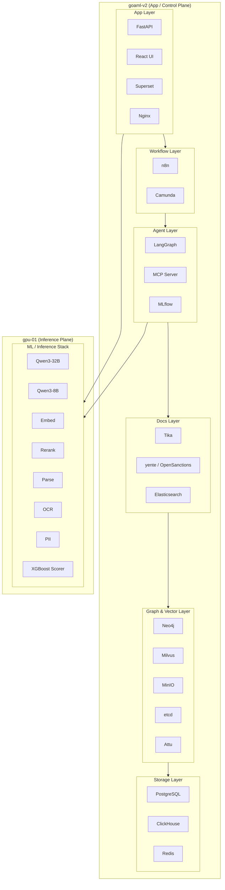
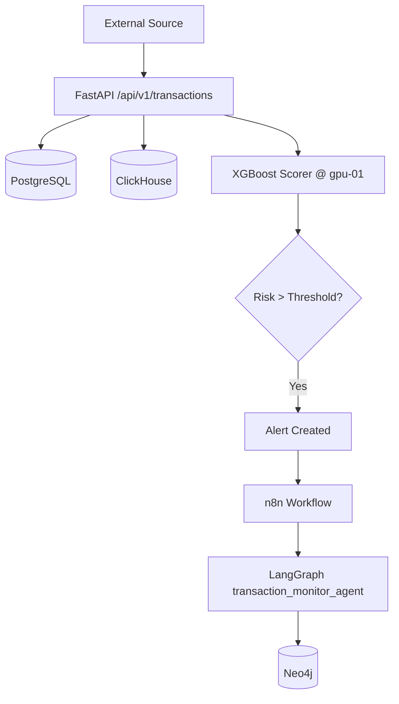
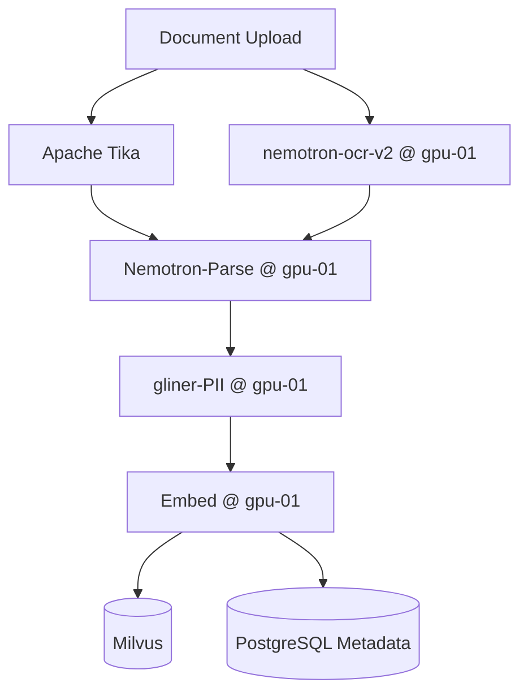
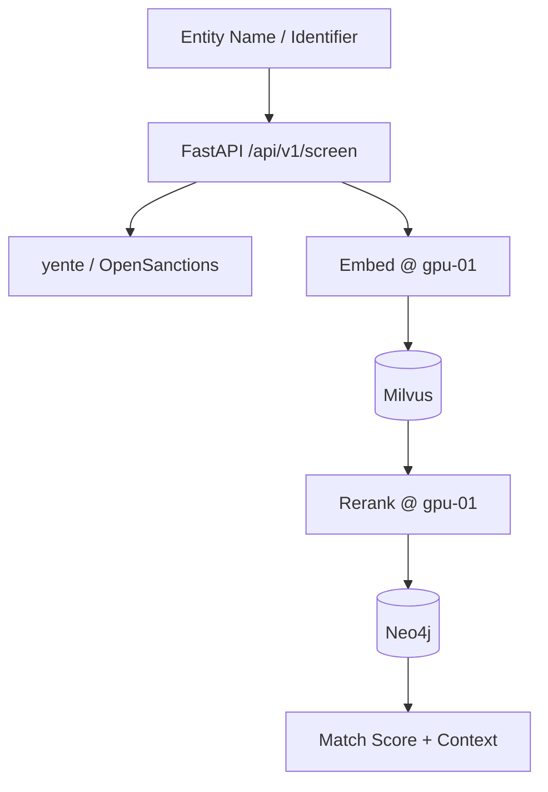
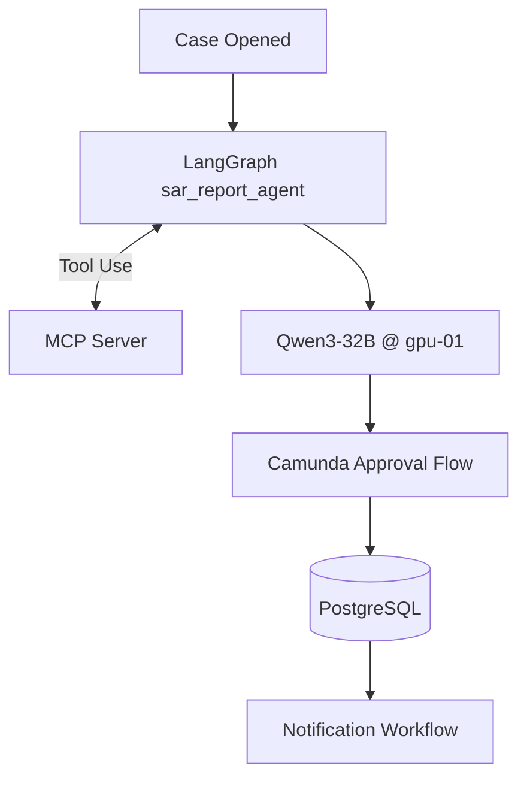

# goAML-V2 — AML Intelligence Platform

> Anti-Money Laundering intelligence platform built on a split deployment: application and analytics services on `goaml-v2`, with model inference services on `gpu-01`.

---

## Table of Contents

1. [Project Overview](#1-project-overview)
2. [Infrastructure](#2-infrastructure)
3. [Current State](#3-current-state)
4. [Architecture](#4-architecture)
5. [ML / Inference Stack](#5-ml--inference-stack)
6. [Service Layers](#6-service-layers)
7. [Port Reference](#7-port-reference)
8. [Docker Deployment](#8-docker-deployment)
9. [Environment Variables](#9-environment-variables)
10. [Data Flow](#10-data-flow)
11. [Roadmap](#11-roadmap)

---

## 1. Project Overview

goAML-V2 is a self-hosted AML analytics platform for:

- transaction risk scoring
- sanctions and PEP screening
- entity and relationship analysis
- document OCR and structured extraction
- semantic retrieval with embeddings and reranking
- SAR drafting and investigative workflows
- BPMN-driven case management and automation

The system is intentionally split into two planes:

- `goaml-v2`: app, workflow, storage, analytics, graph, vector, and support services
- `gpu-01`: model-serving and document-intelligence services

---

## 2. Infrastructure

### App / Control Plane

| Item | Value |
|---|---|
| Host | `goaml-v2` |
| Role | API, UI, workflow, storage, analytics, graph/vector, support services |
| OS | Ubuntu 24.04 |
| CPU | AMD EPYC |
| RAM | 1.5 TB |
| Storage | 15 TB NVMe |
| Path | `/home/ze/goaml-v2` |

### Inference Plane

| Item | Value |
|---|---|
| Host | `gpu-01` |
| IP | `160.30.63.152` |
| Role | LLM, embedding, rerank, OCR, PII, parse, scoring |
| GPU 0 | NVIDIA L40S — 48 GB VRAM |
| GPU 1 | NVIDIA L40S — 48 GB VRAM |
| Total VRAM | 96 GB |
| Path | `/home/ze/goaml-v2/models` |

---

## 3. Current State

The following has been verified from live hosts and copied deployment files:

- `goaml-v2` is running the app/control-plane services
- `gpu-01` is running the model-serving stack
- the app layer is being aligned to call model APIs over `160.30.63.152`
- the app-side deployment source has been copied locally to [remote-goaml-v2-install](/Users/ze/Documents/goaml-v2/remote-goaml-v2-install)
- the model-side deployment source has been copied locally to [remote-gpu-01-models](/Users/ze/Documents/goaml-v2/remote-gpu-01-models)
- the API mapping between the two is documented in [GPU_MODEL_API_INTEGRATION.md](/Users/ze/Documents/goaml-v2/remote-goaml-v2-install/GPU_MODEL_API_INTEGRATION.md)

---

## 4. Architecture

The platform is organized into 7 layers, with the first 6 hosted on `goaml-v2` and the inference layer hosted on `gpu-01`.



---

## 5. ML / Inference Stack

All 8 model-related services were verified on `gpu-01`.

| Container | Model / Service | Port | Runtime | Purpose |
|---|---|---:|---|---|
| `goaml-llm-primary` | `Qwen/Qwen3-32B-FP8` | 8000 | vLLM | Primary reasoning and SAR drafting |
| `goaml-llm-fast` | `Qwen/Qwen3-8B-FP8` | 8002 | vLLM | Fast inference and routing |
| `goaml-embed` | `nvidia/llama-nemotron-embed-1b-v2` | 8001 | vLLM pooling | Embeddings and semantic retrieval |
| `goaml-rerank` | `nvidia/llama-nemotron-rerank-1b-v2` | 8003 | vLLM pooling | Retrieval reranking |
| `goaml-parse` | `nvidia/NVIDIA-Nemotron-Parse-v1.1` | 8022 | vLLM | Structured document parsing |
| `goaml-ocr` | `nemotron-ocr-v2` wrapper | 8021 | FastAPI | OCR for uploaded documents |
| `goaml-pii` | `gliner-pii` wrapper | 8020 | FastAPI | PII/entity extraction |
| `goaml-scorer` | XGBoost scorer | 8010 | FastAPI | Transaction risk scoring |

### Remote API Endpoints

```python
LLM_PRIMARY_URL = "http://160.30.63.152:8000/v1"
LLM_FAST_URL    = "http://160.30.63.152:8002/v1"
EMBED_URL       = "http://160.30.63.152:8001/v1"
RERANK_URL      = "http://160.30.63.152:8003/v1"
PARSE_URL       = "http://160.30.63.152:8022/v1"
OCR_URL         = "http://160.30.63.152:8021"
PII_URL         = "http://160.30.63.152:8020"
SCORER_URL      = "http://160.30.63.152:8010"
```

---

## 6. Service Layers

### 6.1 Storage Layer

| Service | Port | Purpose |
|---|---|---|
| PostgreSQL | 5432 | Primary relational store |
| ClickHouse | 8123 / 9000 | Analytics and time-series workloads |
| Redis | 6379 | Cache and queue backend |

### 6.2 Graph + Vector Layer

| Service | Port | Purpose |
|---|---|---|
| Neo4j | 7474 / 7687 | Entity relationship graph |
| Milvus | 19530 / 9091 | Vector store |
| MinIO | 9001 / 9002 | Object storage |
| etcd | 2379 | Milvus metadata |
| Attu | 8080 | Milvus UI |

### 6.3 Docs + Screening Layer

| Service | Port | Purpose |
|---|---|---|
| Tika | 9998 | Document extraction |
| yente | 8383 | OpenSanctions API |
| Elasticsearch | 9200 | Screening/search backend |

### 6.4 Agent Layer

| Service | Port | Purpose |
|---|---|---|
| MLflow | 5000 | Experiment tracking and registry |
| LangGraph | 8100 | Agent workflow runtime |
| MCP Server | 8200 | Tool access for agents |

### 6.5 Workflow Layer

| Service | Port | Purpose |
|---|---|---|
| n8n | 5678 | Workflow automation |
| Camunda | 8085 | BPMN process engine |

### 6.6 App Layer

| Service | Port | Purpose |
|---|---|---|
| FastAPI | 8000 | Backend API |
| React UI | 3000 | Dashboard frontend |
| Superset | 8088 | Analytics dashboards |
| Nginx | 80 | Reverse proxy and entry point |

---

## 7. Port Reference

### `goaml-v2`

| Port | Service | Protocol |
|---|---|---|
| 80 | Nginx | HTTP |
| 3000 | React UI | HTTP |
| 5000 | MLflow | HTTP |
| 5432 | PostgreSQL | TCP |
| 5678 | n8n | HTTP |
| 6379 | Redis | TCP |
| 7474 | Neo4j Browser | HTTP |
| 7687 | Neo4j Bolt | TCP |
| 8080 | Attu | HTTP |
| 8085 | Camunda | HTTP |
| 8088 | Superset | HTTP |
| 8100 | LangGraph | HTTP |
| 8123 | ClickHouse HTTP | HTTP |
| 8200 | MCP Server | HTTP |
| 8383 | yente | HTTP |
| 9000 | ClickHouse native | TCP |
| 9001 | MinIO Console | HTTP |
| 9002 | MinIO S3 API | HTTP |
| 9091 | Milvus HTTP | HTTP |
| 9200 | Elasticsearch | HTTP |
| 9998 | Apache Tika | HTTP |
| 19530 | Milvus gRPC | gRPC |

### `gpu-01` (`160.30.63.152`)

| Port | Service | Protocol |
|---|---|---|
| 8000 | Qwen3-32B | HTTP |
| 8001 | Embed | HTTP |
| 8002 | Qwen3-8B | HTTP |
| 8003 | Rerank | HTTP |
| 8010 | XGBoost scorer | HTTP |
| 8020 | gliner-PII | HTTP |
| 8021 | nemotron-ocr-v2 | HTTP |
| 8022 | Nemotron-Parse | HTTP |

---

## 8. Docker Deployment

### `goaml-v2`

```bash
docker network create goaml-network

# 1 — Storage
docker compose -f docker-compose.storage.yml --env-file .env.storage up -d

# 2 — Graph + Vector
docker compose -f docker-compose.graph.yml --env-file .env.graph up -d

# 3 — Docs
docker compose -f docker-compose.docs.yml --env-file .env.docs up -d

# 4 — Agent
docker compose -f docker-compose.agent.yml --env-file .env.agent up -d --build

# 5 — Workflow
docker compose -f docker-compose.workflow.yml --env-file .env.workflow up -d

# 6 — App
docker compose -f docker-compose.app.yml --env-file .env.app up -d --build
```

### `gpu-01`

The live model stack is deployed from separate compose projects under:

```bash
/home/ze/goaml-v2/models
```

Local copied model deployment source:

```bash
/Users/ze/Documents/goaml-v2/remote-gpu-01-models
```

---

## 9. Environment Variables

### Shared platform credentials

| Variable | Value / Notes |
|---|---|
| `POSTGRES_USER` | `goaml` |
| `POSTGRES_PASSWORD` | `Asdf@1234` or `Asdf%401234` when URI-encoded |
| `POSTGRES_DB` | `goaml` |
| `CLICKHOUSE_USER` | `goaml` |
| `CLICKHOUSE_PASSWORD` | `Asdf@1234` |
| `REDIS_PASSWORD` | `Asdf@1234` |
| `NEO4J_USER` | `neo4j` |
| `NEO4J_PASSWORD` | `Asdf@1234` |
| `MINIO_ACCESS_KEY` | `minioadmin` |
| `MINIO_SECRET_KEY` | `Asdf@1234` or `Asdf%401234` when URI-encoded |

### GPU API variables

| Variable | Value |
|---|---|
| `LLM_PRIMARY_URL` | `http://160.30.63.152:8000/v1` |
| `LLM_FAST_URL` | `http://160.30.63.152:8002/v1` |
| `EMBED_URL` | `http://160.30.63.152:8001/v1` |
| `RERANK_URL` | `http://160.30.63.152:8003/v1` |
| `PARSE_URL` | `http://160.30.63.152:8022/v1` |
| `OCR_URL` | `http://160.30.63.152:8021` |
| `PII_URL` | `http://160.30.63.152:8020` |
| `SCORER_URL` | `http://160.30.63.152:8010` |

### Special variables

| Variable | Layer | Notes |
|---|---|---|
| `N8N_ENCRYPTION_KEY` | Workflow | Critical secret |
| `SUPERSET_SECRET_KEY` | App | Superset secret |
| `SUPERSET_ADMIN_PASSWORD` | App | Superset admin password |
| `OPENSANCTIONS_DELIVERY_TOKEN` | Docs | Required for OpenSanctions delivery |

---

## 10. Data Flow

### Transaction Ingestion Pipeline



### Document Processing Pipeline



### Entity Screening Pipeline



### SAR Drafting Pipeline



---

## 11. Roadmap

### Phase 2 — Integration & Data Wiring (next)

- Build FastAPI route handlers (`/transactions`, `/alerts`, `/cases`, `/screen`)
- Create PostgreSQL schema (transactions, alerts, cases, entities, users)
- Create ClickHouse schema (transaction time-series)
- Create Milvus collections and indexes
- Define Neo4j entity graph schema
- Register XGBoost model in MLflow model registry
- Build LangGraph agent graphs
- Wire n8n alert trigger workflows
- Build Superset dashboards on ClickHouse + PostgreSQL

### Phase 3 — NIM Integration

- Connect FastAPI to Qwen3-32B for SAR narrative generation
- Connect FastAPI to llama-nemotron-embed for document indexing
- Connect FastAPI to gliner-PII for entity extraction
- Connect nemotron-ocr-v2 into document ingestion pipeline
- Connect Nemotron-Parse for structured document extraction
- Connect XGBoost scorer for real-time transaction risk

### Phase 4 — Production Hardening

- Add authentication (JWT via FastAPI)
- Enable HTTPS (TLS on Nginx)
- Configure ClickHouse retention policies
- Add Prometheus + Grafana monitoring
- Set up automated backups (PostgreSQL, Neo4j, Milvus)
- Load test ML endpoints
- Security audit — secrets rotation, network isolation

---

*goAML-V2 · Built on NVIDIA AI Enterprise · Self-hosted · April 2026*
