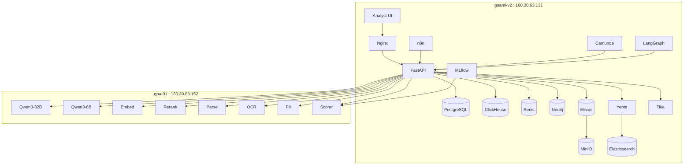
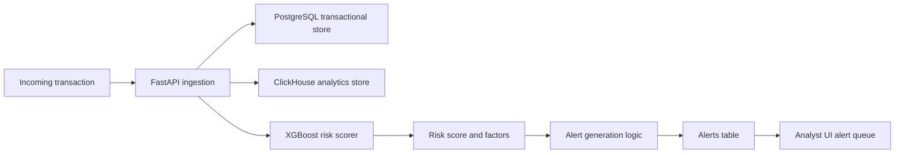
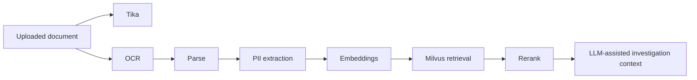
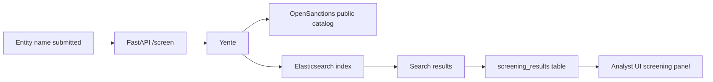
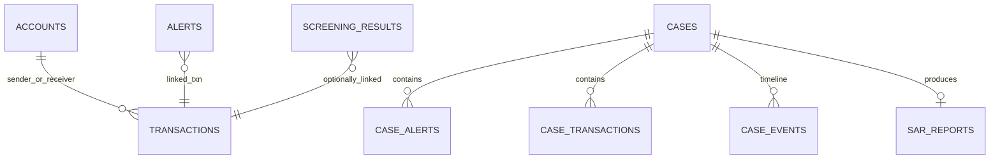
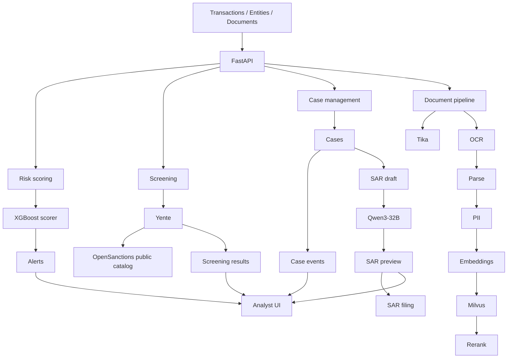

# goAML-v2 Project Overview v3

> Current-state architecture and implementation guide for the goAML-v2 AML analytics platform, updated with the live deployment, Phase 2 backend/UI work, public OpenSanctions screening path, and Qwen-backed SAR drafting.

## 1. Executive Summary

`goAML-v2` is a self-hosted Anti-Money Laundering analytics and investigation platform split across two servers:

- `goaml-v2` at `160.30.63.131`
  - app, workflow, storage, analytics, graph/vector, document support, and UI
- `gpu-01` at `160.30.63.152`
  - model inference, document intelligence, PII, and risk scoring

The platform is designed to handle:

- transaction monitoring and risk scoring
- alert triage and investigation
- sanctions and PEP screening
- case management and timeline history
- SAR drafting and filing workflows
- document OCR, parsing, and PII extraction
- graph and vector-assisted investigations
- workflow automation and analyst support

The current system is beyond planning. It is already running as a live multi-service deployment with working APIs, a browser-accessible analyst UI, live case workflows, case timelines, SAR preview/filing, and LLM-generated SAR drafts.

## 2. Deployment Split

### 2.1 App / Control Plane

| Item | Value |
|---|---|
| Host | `goaml-v2` |
| IP | `160.30.63.131` |
| Role | API, UI, databases, workflow, graph/vector, screening, analytics |
| Main path | `/home/ze/goaml-v2` |
| Local copied source | [remote-goaml-v2-install](/Users/ze/Documents/goaml-v2/remote-goaml-v2-install) |

### 2.2 Inference Plane

| Item | Value |
|---|---|
| Host | `gpu-01` |
| IP | `160.30.63.152` |
| Role | LLMs, embeddings, rerank, OCR, parse, PII, scorer |
| Model deployment path | model-side deployment on GPU host |
| Local copied source | [remote-gpu-01-models](/Users/ze/Documents/goaml-v2/remote-gpu-01-models) |

### 2.3 Separation Principle

The two hosts should remain separate:

- `goaml-v2` owns product and data-plane services
- `gpu-01` owns model-serving and ML inference services
- integration happens over HTTP APIs, not shared local containers

This separation keeps model deployment independent from app deployment and makes it easier to scale or replace either side later.

## 3. Live Service Inventory

### 3.1 `goaml-v2` Services

Verified via live `docker ps` and deployment files:

| Area | Services |
|---|---|
| App | FastAPI, React UI, Nginx, Superset |
| Workflow | n8n, Camunda |
| Agent / orchestration | LangGraph, MCP server, MLflow |
| Storage | PostgreSQL, ClickHouse, Redis |
| Graph / vector | Neo4j, Milvus, MinIO, etcd, Attu |
| Docs / screening | Apache Tika, Yente, Elasticsearch |

### 3.2 `gpu-01` Services

Verified via live `docker ps` and model compose files:

| Container | Runtime | Port | Purpose |
|---|---|---:|---|
| `goaml-llm-primary` | vLLM | 8000 | Primary LLM reasoning and SAR drafting |
| `goaml-llm-fast` | vLLM | 8002 | Fast inference / lightweight reasoning |
| `goaml-embed` | vLLM pooling | 8001 | Semantic embeddings |
| `goaml-rerank` | vLLM pooling | 8003 | Retrieval reranking |
| `goaml-parse` | vLLM | 8022 | Structured document parsing |
| `goaml-ocr` | FastAPI wrapper | 8021 | OCR |
| `goaml-pii` | FastAPI wrapper | 8020 | PII extraction |
| `goaml-scorer` | FastAPI wrapper | 8010 | XGBoost risk scoring |

### 3.3 Dashboard UI Access Matrix

The following dashboard-style UIs are live on `goaml-v2` and were verified as responding on `160.30.63.131`.

Important: this section contains active access details from the current deployment and should be treated as sensitive.

| App | Link | Login | Notes |
|---|---|---|---|
| Analyst UI | `http://160.30.63.131/` | none configured yet | Main AML analyst UI. WSO2 identity is planned later. |
| Superset | `http://160.30.63.131:8088` | `admin` / `Asdf@1234` | Analytics dashboards and BI. Admin user is created from the app-layer compose startup command. |
| n8n | `http://160.30.63.131:5678` | no static user/pass configured in compose | Workflow UI is live. No `N8N_BASIC_AUTH_*` settings are present in the deployed compose, so access is currently governed by n8n's own app bootstrap/session model rather than a shared static credential in env. |
| Camunda | `http://160.30.63.131:8085/camunda/app/` | no explicit credential set in deployed env | BPMN workflow UI is live. The current compose file sets database connectivity only and does not define a custom app username/password. |
| Neo4j Browser | `http://160.30.63.131:7474` | `neo4j` / `Asdf@1234` | Graph investigation and Cypher exploration UI. Bolt endpoint is `bolt://160.30.63.131:7687`. |
| Attu | `http://160.30.63.131:8080` | no separate Attu login configured | Milvus admin UI. It connects to Milvus using `160.30.63.131:19530` or the internal service name `goaml-milvus:19530`. |
| MinIO Console | `http://160.30.63.131:9001` | `minioadmin` / `Asdf@1234` | Object storage console used by Milvus and MLflow. S3 API endpoint is `http://160.30.63.131:9002`. |
| MLflow | `http://160.30.63.131:5000` | none configured | Experiment tracking and model registry UI. No app-layer auth is configured in the current compose. |

## 4. Current Application Architecture



## 5. Core Product Workflows

### 5.1 Transaction Monitoring Workflow



### 5.2 Alert to Case to SAR Workflow

```mermaid
flowchart LR
    A[Alert created] --> B[Analyst opens Alerts page]
    B --> C[Investigate button]
    C --> D[Assign analyst]
    D --> E[Create or reopen case]
    E --> F[Case timeline]
    F --> G[Update case status and summary]
    G --> H[Draft SAR]
    H --> I[SAR preview]
    I --> J[Review and file SAR]
    J --> K[Case status becomes sar_filed]
```



### 5.3 Document Intelligence Workflow



### 5.4 Screening Workflow



## 6. Database Model

The PostgreSQL instance is not a toy schema. It contains both business-domain AML tables and support-service tables.

### 6.1 Main AML Tables

Core business tables verified in schema and/or live database:

- `transactions`
- `accounts`
- `entities`
- `alerts`
- `cases`
- `case_alerts`
- `case_transactions`
- `case_events`
- `sar_reports`
- `documents`
- `screening_results`

### 6.2 Platform Tables Also Present

Shared platform database also includes:

- Camunda `act_*` tables
- Superset `ab_*` tables
- MLflow tables
- n8n workflow and execution tables

### 6.3 Important AML Relationships



## 7. Model Usage Map

### 7.1 Current Inference Usage

| Model / Service | Current role |
|---|---|
| `Qwen3-32B` | Live SAR drafting, future investigative summaries |
| `Qwen3-8B` | Reserved for fast inference and lighter future tasks |
| `Nemotron Embed` | Planned semantic retrieval and vector indexing |
| `Nemotron Rerank` | Planned retrieval quality improvement |
| `Nemotron Parse` | Planned structured document extraction |
| OCR service | Planned scanned document ingestion |
| GLiNER PII | Planned entity/PII extraction from docs/text |
| XGBoost scorer | Live risk scoring support path |

### 7.2 API Endpoints to GPU Host

```text
LLM_PRIMARY_URL = http://160.30.63.152:8000/v1
LLM_FAST_URL    = http://160.30.63.152:8002/v1
EMBED_URL       = http://160.30.63.152:8001/v1
RERANK_URL      = http://160.30.63.152:8003/v1
PARSE_URL       = http://160.30.63.152:8022/v1
OCR_URL         = http://160.30.63.152:8021
PII_URL         = http://160.30.63.152:8020
SCORER_URL      = http://160.30.63.152:8010
```

## 8. What Is Working Right Now

### 8.1 Public UI

Accessible at:

- `http://160.30.63.131/`

Live UI features now include:

- dashboard shell
- transactions view
- alerts view
- cases and SARs view
- case timeline panel
- case action panel
- SAR preview drawer
- alert-level `Investigate` action

### 8.2 Working APIs

Verified working:

- `GET /health`
- `GET /api/v1/status`
- `GET /api/v1/transactions`
- `GET /api/v1/alerts`
- `GET /api/v1/alerts/{id}`
- `POST /api/v1/alerts/{id}/investigate`
- `GET /api/v1/cases`
- `POST /api/v1/cases`
- `GET /api/v1/cases/{id}`
- `PATCH /api/v1/cases/{id}`
- `GET /api/v1/cases/{id}/events`
- `POST /api/v1/cases/{id}/sar`
- `GET /api/v1/cases/{id}/sar`
- `POST /api/v1/cases/{id}/sar/file`

### 8.3 Live Case Workflow Already Verified

Verified case:

- `CASE-2026-0800`

Verified events:

- `created`
- `updated`
- `sar_drafted`
- `sar_filed`

### 8.4 LLM Drafting Verified

Verified test case:

- `CASE-2026-0801`

Verified SAR:

- `SAR-6906D66717F9`
- `ai_drafted: true`
- `ai_model: Qwen3-32B`

This confirms the SAR narrative is currently being drafted by the live GPU-hosted LLM, not only by a template fallback.

## 9. Latest Changes Implemented So Far

### 9.1 Phase 2 Backend Extensions

Implemented:

- alert detail endpoint
- alert investigation action
- case create/list/detail/update
- case timeline endpoint
- SAR draft endpoint
- SAR file endpoint
- SAR read/preview endpoint
- screening endpoint with better error handling

### 9.2 UI Enhancements

Implemented:

- live transactions from API
- live alerts from API
- live cases from API
- case detail panel
- case timeline rendering
- case status update
- case assignment update
- SAR draft action
- SAR file action
- alert `Investigate` button
- SAR preview drawer

### 9.3 Screening Fix

`yente` previously failed because:

- it used the commercial manifest
- no `OPENSANCTIONS_DELIVERY_TOKEN` was configured

Alternative implemented:

- switched `yente` to the built-in public `civic.yml` manifest
- public OpenSanctions indexing is now in progress
- app now returns a clean `503` warm-up message instead of a raw `500`

### 9.4 Model Integration Fix

App-side model URLs were aligned to the real GPU host instead of stale internal names.

### 9.5 Runtime Hardening During This Work

Fixed:

- JSON/string normalization issues from Postgres rows
- `sar_ref` generation
- SAR filing state transition
- case/SAR UI workflow continuity
- duplicate-case prevention on repeated alert investigation

## 10. Screening Without an OpenSanctions API Key

You said you do not have an OpenSanctions API key. The practical alternative now in place is:

- use the public OpenSanctions data catalog via `yente`'s built-in `civic.yml`
- no delivery token required
- slower first-time indexing
- once indexing completes, screening works against public data

Current state:

- indexing is still running
- app correctly reports that screening is warming up

Recommended follow-up after indexing completes:

1. verify `/api/v1/screen` returns real results
2. keep public catalog for now
3. only move to delivery token later if you need fresher or broader managed datasets

## 11. Implementation Phases

### Phase 1 — Infrastructure and Base Platform

Status: complete enough to run live

Included:

- multi-service Docker deployment
- storage, workflow, graph/vector, and UI layers
- GPU inference host
- model-serving APIs

### Phase 2 — Integration and Data Wiring

Status: largely implemented

Completed or substantially completed:

- FastAPI route handlers for transactions, alerts, cases, screening
- PostgreSQL business schema
- ClickHouse schema
- case workflows
- alert investigation flow
- case timelines
- SAR draft and file flow
- analyst UI wiring for alerts/cases/SARs

Still maturing in Phase 2:

- screening needs the public index build to finish
- graph page is still mostly a placeholder
- document ingestion UI is not complete

### Phase 3 — Model Integration

Status: started

Completed:

- app connected to `Qwen3-32B` for live SAR narrative drafting

Planned next in Phase 3:

- connect embeddings for document indexing
- connect rerank for evidence selection
- connect Parse and OCR into document ingestion
- connect PII extraction into document/entity workflows
- expand `Qwen3-8B` usage for fast triage and summarization

### Phase 4 — Workflow and Investigation Depth

Planned:

- richer alert actions: dismiss, false positive, escalate
- document upload and attachment handling
- graph exploration tied to real entities and cases
- review/approval stages before SAR filing
- automated workflows through n8n and Camunda

### Phase 5 — Enterprise Hardening

Planned:

- WSO2 identity integration
- role-aware UI
- audit policy refinement
- HTTPS and secret rotation
- Prometheus / Grafana monitoring
- backups and retention
- load testing and security review

## 12. Recommended Near-Term Roadmap

### 12.1 Immediate Next Steps

1. Wait for `yente` public index build to complete and verify live screening
2. Surface screening warm-up state more nicely in the UI
3. Add alert dismissal / false-positive / escalation actions
4. Add SAR review / approve states before filing
5. Add document upload and OCR/Parse/PII workflow

### 12.2 After That

1. Plug embeddings and rerank into document/case retrieval
2. Connect graph workflows to Neo4j
3. Add LangGraph-driven investigation support
4. Add MLflow-backed model version visibility in the app
5. Introduce WSO2 identity when ready

## 13. Future Enhancements

Planned future enhancements likely to add the most value:

- case note system and analyst collaboration
- attachment support on alerts, cases, and SARs
- entity profile pages with screening and graph context
- retrieval-augmented case summarization
- LLM-assisted alert explanation
- document evidence packs for SARs
- human-in-the-loop review queues
- model routing between `Qwen3-8B` and `Qwen3-32B`
- screening watchlists and recurring re-screen jobs
- dashboard drill-downs into ClickHouse analytics

## 14. End-to-End System Map



## 15. Source of Truth Files

### Local project documentation

- [goAML-V2-PROJECT-OVERVIEW.md](/Users/ze/Documents/goaml-v2/goAML-V2-PROJECT-OVERVIEW.md)
- [gpu-01-running-models.md](/Users/ze/Documents/goaml-v2/gpu-01-running-models.md)
- [goaml-v2-project-overview-v3.md](/Users/ze/Documents/goaml-v2/goaml-v2-project-overview-v3.md)

### App-side deployment copy

- [remote-goaml-v2-install](/Users/ze/Documents/goaml-v2/remote-goaml-v2-install)
- [GPU_MODEL_API_INTEGRATION.md](/Users/ze/Documents/goaml-v2/remote-goaml-v2-install/GPU_MODEL_API_INTEGRATION.md)

### Model-side deployment copy

- [remote-gpu-01-models](/Users/ze/Documents/goaml-v2/remote-gpu-01-models)

## 16. Practical Status Summary

If someone new joins the project today, the correct mental model is:

- the platform is already deployed and usable
- the app and GPU model planes are cleanly separated
- Phase 2 is mostly real, not aspirational
- sanctions screening no longer needs a commercial token, but the first public index build is still running
- SAR drafting is already using `Qwen3-32B`
- the next work should focus on completing screening, document workflows, richer alert actions, and review-grade SAR workflows
