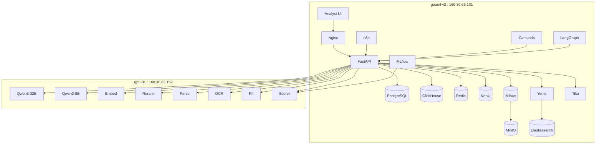
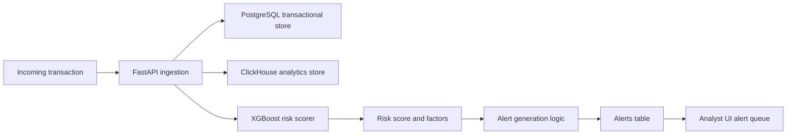
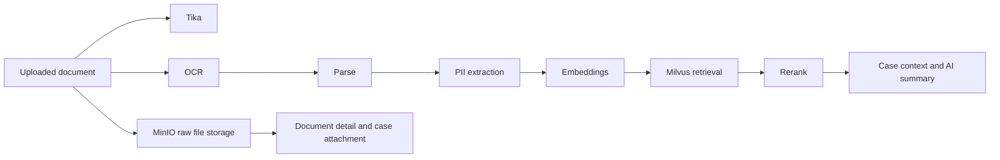
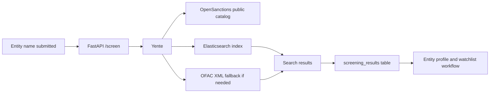
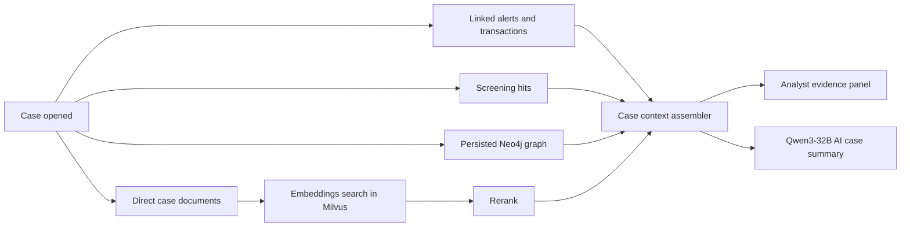
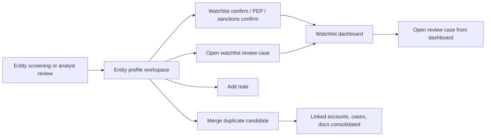
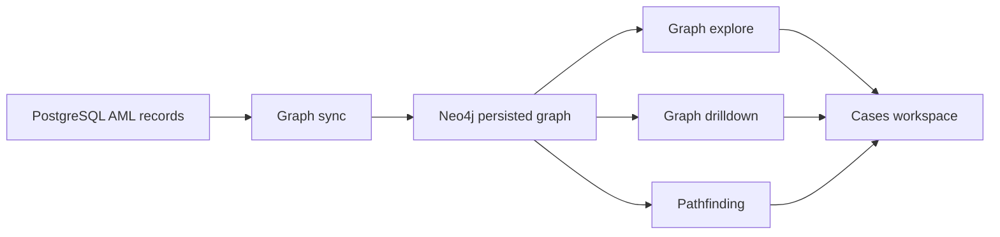
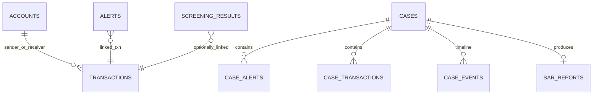
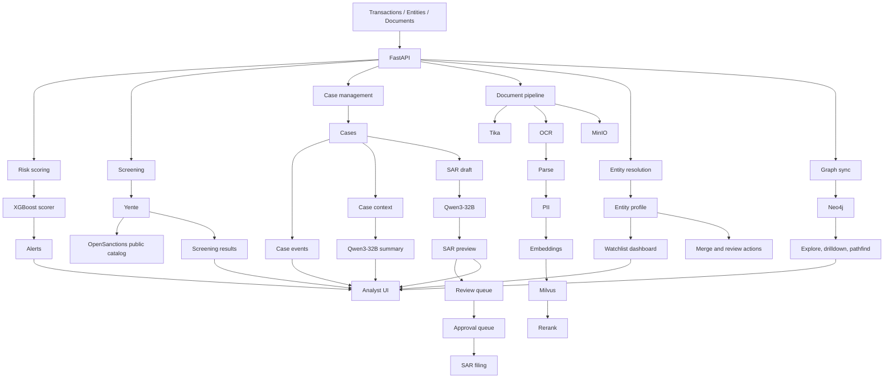

# goAML-v2 Project Overview v3

> Current-state architecture and implementation guide for the goAML-v2 AML analytics platform, updated with the live deployment, Phase 2 backend/UI work, public OpenSanctions screening path, Qwen-backed SAR drafting, first-class SAR reviewer/approver queues, and the entity watchlist dashboard.

## 1. Executive Summary

`goAML-v2` is a self-hosted Anti-Money Laundering analytics and investigation platform split across two servers:

- `goaml-v2` at `160.30.63.131`
  - app, workflow, storage, analytics, graph/vector, document support, and UI
- `gpu-01` at `160.30.63.152`
  - model inference, document intelligence, PII, and risk scoring

The platform is designed to handle:

- transaction monitoring and risk scoring
- alert triage and investigation
- sanctions and PEP screening
- case management and timeline history
- reviewer / approver SAR queues and filing workflows
- reviewer workload balancing and SLA-driven queue automation
- entity profile, watchlist, and merge resolution workflows
- automatic watchlist case escalation when re-screening finds new matches
- analyst collaboration through case notes and tasks
- document OCR, parsing, PII extraction, and MinIO-backed evidence storage
- graph and vector-assisted investigations with persisted Neo4j evidence
- retrieval-backed investigation context and AI case summaries
- workflow automation and analyst support
- unattended watchlist re-screen automation through n8n schedules

The current system is beyond planning. It is already running as a live multi-service deployment with working APIs, a browser-accessible analyst UI, live case workflows, case timelines, SAR preview/filing, and LLM-generated SAR drafts.

## 2. Deployment Split

### 2.1 App / Control Plane

| Item | Value |
|---|---|
| Host | `goaml-v2` |
| IP | `160.30.63.131` |
| Role | API, UI, databases, workflow, graph/vector, screening, analytics |
| Main path | `/home/ze/goaml-v2` |
| Local copied source | [remote-goaml-v2-install](/Users/ze/Documents/goaml-v2/remote-goaml-v2-install) |

### 2.2 Inference Plane

| Item | Value |
|---|---|
| Host | `gpu-01` |
| IP | `160.30.63.152` |
| Role | LLMs, embeddings, rerank, OCR, parse, PII, scorer |
| Model deployment path | model-side deployment on GPU host |
| Local copied source | [remote-gpu-01-models](/Users/ze/Documents/goaml-v2/remote-gpu-01-models) |

### 2.3 Separation Principle

The two hosts should remain separate:

- `goaml-v2` owns product and data-plane services
- `gpu-01` owns model-serving and ML inference services
- integration happens over HTTP APIs, not shared local containers

This separation keeps model deployment independent from app deployment and makes it easier to scale or replace either side later.

## 3. Live Service Inventory

### 3.1 `goaml-v2` Services

Verified via live `docker ps` and deployment files:

| Area | Services |
|---|---|
| App | FastAPI, React UI, Nginx, Superset |
| Workflow | n8n, Camunda |
| Agent / orchestration | LangGraph, MCP server, MLflow |
| Storage | PostgreSQL, ClickHouse, Redis |
| Graph / vector | Neo4j, Milvus, MinIO, etcd, Attu |
| Docs / screening | Apache Tika, Yente, Elasticsearch |

### 3.2 `gpu-01` Services

Verified via live `docker ps` and model compose files:

| Container | Runtime | Port | Purpose |
|---|---|---:|---|
| `goaml-llm-primary` | vLLM | 8000 | Primary LLM reasoning and SAR drafting |
| `goaml-llm-fast` | vLLM | 8002 | Fast inference / lightweight reasoning |
| `goaml-embed` | vLLM pooling | 8001 | Semantic embeddings |
| `goaml-rerank` | vLLM pooling | 8003 | Retrieval reranking |
| `goaml-parse` | vLLM | 8022 | Structured document parsing |
| `goaml-ocr` | FastAPI wrapper | 8021 | OCR |
| `goaml-pii` | FastAPI wrapper | 8020 | PII extraction |
| `goaml-scorer` | FastAPI wrapper | 8010 | XGBoost risk scoring |

### 3.3 Dashboard UI Access Matrix

The following dashboard-style UIs are live on `goaml-v2` and were verified as responding on `160.30.63.131`.

Important: this section contains active access details from the current deployment and should be treated as sensitive.

| App | Link | Login | Notes |
|---|---|---|---|
| Analyst UI | `http://160.30.63.131/` | none configured yet | Main AML analyst UI. WSO2 identity is planned later. |
| Superset | `http://160.30.63.131:8088` | `admin` / `Asdf@1234` | Analytics dashboards and BI. Admin user is created from the app-layer compose startup command. |
| n8n | `http://160.30.63.131:5678` | no static user/pass configured in compose | Workflow UI is live. No `N8N_BASIC_AUTH_*` settings are present in the deployed compose, so access is currently governed by n8n's own app bootstrap/session model rather than a shared static credential in env. Active workflows now include daily due-only and weekly full watchlist re-screen jobs plus a weekday SAR queue rebalance workflow. |
| Camunda | `http://160.30.63.131:8085/camunda/app/` | no explicit credential set in deployed env | BPMN workflow UI is live. The current compose file sets database connectivity only and does not define a custom app username/password. |
| Neo4j Browser | `http://160.30.63.131:7474` | `neo4j` / `Asdf@1234` | Graph investigation and Cypher exploration UI. Bolt endpoint is `bolt://160.30.63.131:7687`. |
| Attu | `http://160.30.63.131:8080` | no separate Attu login configured | Milvus admin UI. It connects to Milvus using `160.30.63.131:19530` or the internal service name `goaml-milvus:19530`. |
| MinIO Console | `http://160.30.63.131:9001` | `minioadmin` / `Asdf@1234` | Object storage console used by Milvus and MLflow. S3 API endpoint is `http://160.30.63.131:9002`. |
| MLflow | `http://160.30.63.131:5000` | none configured | Experiment tracking and model registry UI. No app-layer auth is configured in the current compose. |

## 4. Current Application Architecture



## 5. Core Product Workflows

### 5.1 Transaction Monitoring Workflow



### 5.2 Alert to Case to SAR Workflow

```mermaid
flowchart LR
    A[Alert created] --> B[Analyst opens Alerts page]
    B --> C[Investigate button]
    C --> D[Assign analyst]
    D --> E[Create or reopen case]
    E --> F[Case timeline]
    F --> G[Case notes, tasks, and graph evidence]
    G --> H[AI summary and investigation context]
    H --> I[Draft SAR]
    I --> J[SAR preview]
    J --> K[Submit for review]
    K --> L[Approve or reject]
    L --> M[File SAR]
    M --> N[Case status becomes sar_filed]
```



### 5.3 Document Intelligence Workflow



### 5.4 Screening Workflow



### 5.5 Investigation Context Workflow



### 5.6 Entity Resolution and Watchlist Workflow



### 5.7 Persisted Graph Workflow



## 6. Database Model

The PostgreSQL instance is not a toy schema. It contains both business-domain AML tables and support-service tables.

### 6.1 Main AML Tables

Core business tables verified in schema and/or live database:

- `transactions`
- `accounts`
- `entities`
- `alerts`
- `cases`
- `case_alerts`
- `case_transactions`
- `case_events`
- `case_notes`
- `case_tasks`
- `sar_reports`
- `documents`
- `screening_results`

### 6.2 Platform Tables Also Present

Shared platform database also includes:

- Camunda `act_*` tables
- Superset `ab_*` tables
- MLflow tables
- n8n workflow and execution tables

### 6.3 Important AML Relationships



## 7. Model Usage Map

### 7.1 Current Inference Usage

| Model / Service | Current role |
|---|---|
| `Qwen3-32B` | Live SAR drafting and live AI case summary generation |
| `Qwen3-8B` | Deployed fast LLM reserved for lighter triage and future low-latency summarization |
| `Nemotron Embed` | Live document embedding generation, Milvus indexing, and semantic retrieval for case context |
| `Nemotron Rerank` | Live reranking in retrieval-backed investigation context |
| `Nemotron Parse` | Live structured document extraction path in document analysis |
| OCR service | Live GPU-backed image OCR for analyst uploads on `gpu-01` |
| GLiNER PII | Live entity and PII extraction from uploaded documents/text |
| XGBoost scorer | Live transaction risk scoring support path |

### 7.2 API Endpoints to GPU Host

```text
LLM_PRIMARY_URL = http://160.30.63.152:8000/v1
LLM_FAST_URL    = http://160.30.63.152:8002/v1
EMBED_URL       = http://160.30.63.152:8001/v1
RERANK_URL      = http://160.30.63.152:8003/v1
PARSE_URL       = http://160.30.63.152:8022/v1
OCR_URL         = http://160.30.63.152:8021
PII_URL         = http://160.30.63.152:8020
SCORER_URL      = http://160.30.63.152:8010
```

## 8. What Is Working Right Now

### 8.1 Public UI

Accessible at:

- `http://160.30.63.131/`

Live UI features now include:

- dashboard shell
- transactions view
- transaction investigation workspace
- alerts view
- alert resolution workspace with analyst notes
- cases and SARs view
- AI case summary generation
- investigation context with direct documents, retrieved evidence, screening hits, and graph context
- SAR reviewer / approver queue
- case collaboration notes and task management
- entity profile and resolution workspace
- entity watchlist dashboard
- watchlist case creation and reuse
- entity merge candidate review and merge actions
- entity screening with live sanctions results
- network graph exploration
- graph drilldown and case-centric pathfinding
- direct graph actions from cases, alerts, transactions, and document graph candidates
- document intelligence workspace
- MinIO-backed case evidence uploads and document attachments
- case timeline panel
- case action panel
- SAR preview drawer
- alert-level `Investigate` action

### 8.2 Working APIs

Verified working:

- `GET /health`
- `GET /api/v1/status`
- `POST /api/v1/transactions`
- `GET /api/v1/transactions`
- `GET /api/v1/transactions/{id}`
- `GET /api/v1/alerts`
- `PATCH /api/v1/alerts/{id}`
- `GET /api/v1/alerts/{id}`
- `POST /api/v1/alerts/{id}/investigate`
- `POST /api/v1/alerts/{id}/actions`
- `POST /api/v1/screen`
- `GET /api/v1/sars/queue`
- `GET /api/v1/cases`
- `POST /api/v1/cases`
- `GET /api/v1/cases/{id}`
- `PATCH /api/v1/cases/{id}`
- `GET /api/v1/cases/{id}/events`
- `GET /api/v1/cases/{id}/context`
- `POST /api/v1/cases/{id}/summary`
- `GET /api/v1/cases/{id}/tasks`
- `POST /api/v1/cases/{id}/tasks`
- `PATCH /api/v1/cases/{id}/tasks/{task_id}`
- `GET /api/v1/cases/{id}/notes`
- `POST /api/v1/cases/{id}/notes`
- `POST /api/v1/cases/{id}/sar`
- `POST /api/v1/cases/{id}/sar/review`
- `GET /api/v1/cases/{id}/sar`
- `POST /api/v1/cases/{id}/sar/file`
- `GET /api/v1/documents`
- `GET /api/v1/documents/{id}`
- `POST /api/v1/documents/analyze`
- `POST /api/v1/cases/{id}/documents/analyze`
- `POST /api/v1/cases/{id}/documents/{document_id}/attach`
- `GET /api/v1/entities`
- `GET /api/v1/entities/watchlist`
- `GET /api/v1/entities/{id}`
- `POST /api/v1/entities/{id}/resolve`
- `POST /api/v1/graph/explore`
- `POST /api/v1/graph/drilldown`
- `POST /api/v1/graph/pathfind`
- `POST /api/v1/graph/sync`

### 8.3 Live Case Workflow Already Verified

Verified case:

- `CASE-2026-0800`

Verified events:

- `created`
- `updated`
- `sar_drafted`
- `sar_filed`

### 8.4 LLM Drafting Verified

Verified test case:

- `CASE-2026-0801`

Verified SAR:

- `SAR-6906D66717F9`
- `ai_drafted: true`
- `ai_model: Qwen3-32B`

This confirms the SAR narrative is currently being drafted by the live GPU-hosted LLM, not only by a template fallback.

### 8.5 AI Investigation Context and Summary Verified

Verified live:

- `GET /api/v1/cases/{id}/context` returns:
  - linked alerts
  - linked transactions
  - direct case documents
  - screening hits
  - semantically retrieved documents from Milvus
  - reranked evidence
  - graph expansion from Neo4j
- `POST /api/v1/cases/{id}/summary` generates and stores:
  - `ai_summary`
  - `ai_risk_factors`
  - `ai_summary_generated` case event

This confirms the analyst workspace already has retrieval-backed case context plus an LLM summary layer, not just manual case notes.

### 8.6 Reviewer / Approver and Watchlist Queues Verified

Verified queue state after the latest pristine reseed:

- SAR review queue counts:
  - draft/rejected: `0`
  - pending review: `4`
  - approved / ready to file: `4`
  - filed: `10`
  - total SARs: `18`
- example review queue case refs:
  - `CASE-SD-0016`
  - `CASE-SD-0015`
  - `CASE-SD-0014`
- example approval queue case refs:
  - `CASE-SD-0012`
  - `CASE-SD-0011`
  - `CASE-SD-0010`

Verified watchlist dashboard state after the latest pristine reseed:

- active watchlist entities: `12`
- removed watchlist entities: `0`
- active watchlist entities with open review cases: `2`
- critical watchlist entities: `6`
- total watchlist entities: `12`
- example watchlist entities:
  - `East Pier Exports PLC`
  - `Atlas Capital Pte Ltd`
  - `Harborline Ventures PLC`
  - `Farah Habib`
  - `Sajid Latif`
- example open review cases linked from the watchlist:
  - `CASE-SD-0037`
  - `CASE-SD-0036`

### 8.7 Screening, Graph, and Documents Verified

Verified live:

- `POST /api/v1/screen` returns public-source sanctions matches without a commercial delivery token
- `POST /api/v1/graph/explore` returns connected graph data for cases, alerts, transactions, and screening hits
- `POST /api/v1/graph/drilldown` returns persisted Neo4j relationship evidence for cases, alerts, transactions, accounts, documents, and screening hits
- `POST /api/v1/graph/pathfind` returns case-centric and counterparty paths across the persisted Neo4j graph
- `POST /api/v1/graph/sync` maintains a persisted investigation graph from PostgreSQL into Neo4j
- `POST /api/v1/documents/analyze` stores analyst-submitted documents with:
  - OCR support for image uploads
  - structured extraction
  - PII/entity extraction
  - embedding generation
  - Milvus vector indexing
- `POST /api/v1/cases/{id}/documents/analyze` stores raw files in MinIO and attaches them directly to the case
- `POST /api/v1/cases/{id}/documents/{document_id}/attach` links previously analyzed documents into case evidence

Verified document example:

- document id `55d235c4-c19a-48da-8c82-5d95cf4e45bd`
- `vector_status: embedded_in_milvus`
- `pii_detected: true`
- `parse_applied: true`

Verified OCR smoke-test example:

- document id `2a465a79-52c0-40ed-908a-4b7320ca1ee3`
- `ocr_applied: true`
- `parse_applied: true`
- `pii_detected: true`
- `vector_status: embedded_in_milvus`
- OCR response mode currently: `cuda`

### 8.8 Dense Seed Dataset Verified

The platform now includes a large seeded AML investigation dataset for demos, testing, and analyst workflow validation.

Latest verified seed batch:

- seed tag: `synthetic_aml_dense_v1`
- accounts: `60`
- entities: `48`
- transactions: `756`
- alerts: `160`
- cases: `42`
- documents: `108`
- screening results: `120`
- SARs: `16`
- persisted Neo4j graph: `1365` nodes and `3251` edges

This dataset is safe to refresh because the seed workflow only replaces prior rows created by the same seed tag and leaves unrelated live data untouched.

## 9. Latest Changes Implemented So Far

### 9.1 Phase 2 Backend Extensions

Implemented:

- transaction ingest, scoring, alert generation, and transaction detail APIs
- alert detail endpoint
- alert investigation action
- alert resolution actions for dismiss, false positive, escalate, and analyst notes
- case create/list/detail/update
- case timeline endpoint
- case investigation context endpoint
- AI case summary endpoint
- case collaboration note and task endpoints
- SAR draft endpoint
- SAR review / approval endpoint
- SAR file endpoint
- SAR reviewer / approver queue endpoint
- SAR read/preview endpoint
- document list/detail/analyze endpoints
- case document analyze and attach endpoints
- entity list endpoint
- entity profile endpoint
- entity resolution endpoint
- entity watchlist dashboard endpoint
- graph explore endpoint
- graph sync endpoint
- screening endpoint with better error handling

### 9.2 UI Enhancements

Implemented:

- live transactions from API
- transaction investigation workspace
- live alerts from API
- alert resolution workspace
- live cases from API
- case detail panel
- case timeline rendering
- case status update
- case assignment update
- case notes and team tasks panel
- SAR draft action
- SAR review / approve / reject actions
- SAR file action
- dedicated SAR review queue page
- alert `Investigate` button
- SAR preview drawer
- entity profile and entity resolution workspace
- watchlist dashboard page with open-case links
- graph canvas and graph summary panel
- graph drilldown and pathfinding panels
- direct graph launch from alerts and transactions
- document analysis workspace
- OCR smoke-test path from the UI
- one-click graph exploration from document graph candidates
- case evidence attachment from retrieved documents
- AI case summary action in the case workspace
- entity watchlist case actions
- entity merge workflow controls

### 9.3 Screening Fix

`yente` previously failed because:

- it used the commercial manifest
- no `OPENSANCTIONS_DELIVERY_TOKEN` was configured

Alternative implemented:

- switched `yente` to the built-in public `civic.yml` manifest
- screening now works against public-source matches without a commercial token
- OFAC-style fallback logic is available if upstream screening is temporarily unavailable
- the app still has graceful fallback behavior if indexing or upstream search is temporarily unavailable

### 9.4 Intelligence and Graph Implementation

Implemented:

- MinIO-backed raw document storage
- Milvus vector indexing for analyzed documents
- retrieval-backed case context using embeddings and rerank
- persisted Neo4j graph synchronization from PostgreSQL
- graph exploration, drilldown, and pathfinding APIs
- direct graph evidence launch from cases, alerts, transactions, and document candidates
- AI case summaries stored back onto cases with risk factors

### 9.5 Entity Resolution and Watchlist Workflows

Implemented:

- watchlist confirmation
- PEP confirmation
- sanctions confirmation
- entity notes and resolution history
- create or reuse watchlist review case
- remove from watchlist
- duplicate candidate review
- duplicate merge workflow with linked-record consolidation
- watchlist dashboard with open-case counts

### 9.6 Model Integration Fix

Implemented:

- app-side model URLs aligned to the real GPU host instead of stale internal names
- OCR container corrected to run in true CUDA mode on `gpu-01`
- Qwen3-32B wired into SAR drafting and AI case summaries
- embedding, rerank, parse, PII, and scorer URLs aligned to the live inference host

### 9.7 Runtime Hardening During This Work

Fixed:

- JSON/string normalization issues from Postgres rows
- `sar_ref` generation
- SAR filing state transition
- case/SAR UI workflow continuity
- duplicate-case prevention on repeated alert investigation
- persisted Neo4j graph synchronization plus graph-first analyst workflows
- safe dense-data seeding for demo and workflow validation

## 10. Screening Without an OpenSanctions API Key

You said you do not have an OpenSanctions API key. The practical alternative now in place is:

- use the public OpenSanctions data catalog via `yente`'s built-in `civic.yml`
- keep OFAC-style fallback matching logic available inside the app
- no delivery token required
- slower first-time indexing on first startup
- once the public catalog is indexed, screening works against public data

Current state:

- public-data screening is live
- `/api/v1/screen` is returning real matches
- fallback handling remains in place for resilience during future re-index cycles

Recommended follow-up after indexing completes:

1. keep the public catalog for now
2. optionally add recurring re-screen jobs and screening watchlists
3. only move to delivery token later if you need fresher or broader managed datasets

## 11. Implementation Phases

### Phase 1 — Infrastructure and Base Platform

Status: complete and live

Included:

- multi-service Docker deployment
- storage, workflow, graph/vector, and UI layers
- GPU inference host
- model-serving APIs

### Phase 2 — Integration and Data Wiring

Status: implemented and live for core analyst workflows

Completed or substantially completed:

- FastAPI route handlers for transactions, alerts, cases, screening
- PostgreSQL business schema
- ClickHouse schema
- case workflows
- alert investigation flow
- alert resolution flow with analyst notes
- case timelines
- SAR draft and file flow
- analyst UI wiring for alerts/cases/SARs
- analyst UI wiring for screening, graph exploration, and document intelligence
- document registry backed by PostgreSQL
- raw document storage in MinIO
- embedding generation and Milvus vector write path
- direct case document attachment workflow
- persistent Neo4j graph synchronization from PostgreSQL
- graph drilldown, relationship evidence, and pathfinding from the analyst UI
- entity profile workspace and watchlist dashboard
- collaboration notes and tasks
- unattended n8n watchlist re-screen schedules
- automated SAR queue rebalancing from SLA analytics
- automatic case escalation and follow-up task creation when watchlist re-screening finds new matches
- seeded AML dataset for dense end-to-end workflow testing

Still maturing in Phase 2:

- graph/vector retrieval can be pushed deeper into analyst case workflows
- broader workflow automation across n8n / Camunda is still limited outside the watchlist re-screen runner

### Phase 3 — Model Integration

Status: materially implemented and live

Completed:

- app connected to `Qwen3-32B` for live SAR narrative drafting
- app connected to `Qwen3-32B` for live AI case summaries
- app connected to public-source sanctions screening through `yente`
- app connected to GLiNER PII for live document/entity extraction
- app connected to embeddings for Milvus-backed document indexing
- app connected to rerank for retrieval-backed case context
- app connected to CUDA-backed OCR for image-based document ingestion
- app connected to parse for structured extraction
- app connected to XGBoost scoring for transaction monitoring

Planned next in Phase 3:

- deepen OCR and Parse usage for harder semi-structured and multilingual document ingestion
- connect PII extraction outputs into entity resolution workflows
- expand `Qwen3-8B` usage for fast triage and summarization

### Phase 4 — Workflow and Investigation Depth

Status: started, but not yet complete

Already implemented in this phase:

- SAR draft, review, approval, reject, and filing lifecycle
- first-class reviewer / approver queues
- reviewer / approver SLA dashboards and workload analytics
- escalation routing by analyst team and inferred region
- automated SAR queue workload rebalance through n8n
- SLA breach notification dispatch and notification history tracking
- entity watchlist dashboard and review-case entry points
- recurring watchlist re-screen automation through n8n
- automatic watchlist review-case escalation on new screening matches
- formal Camunda orchestration for SAR review and watchlist escalation flows
- dedicated analyst-facing Workflow Ops, n8n Monitor, and Camunda dashboards with live polling
- entity merge and watchlist resolution workflows
- analyst collaboration notes and tasks

Still planned:

- broader automated workflows through n8n and Camunda beyond SAR and watchlist flows
- additional recurring watchlist review playbooks beyond re-screening
- richer entity merge confidence and entity resolution automation
- deeper alert, case, and entity collaboration workflows

### Phase 5 — Enterprise Hardening

Planned:

- WSO2 identity integration
- role-aware UI
- audit policy refinement
- HTTPS and secret rotation
- Prometheus / Grafana monitoring
- backups and retention
- load testing and security review

## 12. Recommended Near-Term Roadmap

### 12.1 Immediate Next Steps

1. Push retrieval and rerank deeper into case evidence assembly and summaries
2. Add workload balancing and escalation logic on top of the reviewer / approver SLA dashboards
3. Extend graph actions and evidence packs deeper into end-to-end alert and document workflows
4. Drive more analyst workflows through n8n, Camunda, and LangGraph orchestration
5. Add recurring compliance playbooks beyond the watchlist re-screen runner

### 12.2 After That

1. Improve entity resolution confidence scoring and duplicate automation
2. Add MLflow-backed model version visibility in the app
3. Introduce WSO2 identity when ready
4. Add role-aware approvals and audit controls
5. Expand dashboard drill-downs into ClickHouse and Superset

## 13. Future Enhancements

Planned future enhancements likely to add the most value:

- attachment support on alerts and SARs
- LLM-assisted alert explanation
- document evidence packs for SARs
- deeper queue balancing and SLA escalation automation
- recurring watchlist review, re-screen, and downstream case escalation playbooks
- automated entity merge suggestions
- model routing between `Qwen3-8B` and `Qwen3-32B`
- MLflow model/version visibility in the analyst app
- role-aware approval policies
- dashboard drill-downs into ClickHouse analytics

## 14. End-to-End System Map



## 15. Source of Truth Files

### Local project documentation

- [goAML-V2-PROJECT-OVERVIEW.md](/Users/ze/Documents/goaml-v2/goAML-V2-PROJECT-OVERVIEW.md)
- [gpu-01-running-models.md](/Users/ze/Documents/goaml-v2/gpu-01-running-models.md)
- [goaml-v2-project-overview-v3.md](/Users/ze/Documents/goaml-v2/goaml-v2-project-overview-v3.md)

### App-side deployment copy

- [remote-goaml-v2-install](/Users/ze/Documents/goaml-v2/remote-goaml-v2-install)
- [GPU_MODEL_API_INTEGRATION.md](/Users/ze/Documents/goaml-v2/remote-goaml-v2-install/GPU_MODEL_API_INTEGRATION.md)

### Model-side deployment copy

- [remote-gpu-01-models](/Users/ze/Documents/goaml-v2/remote-gpu-01-models)

## 16. Practical Status Summary

If someone new joins the project today, the correct mental model is:

- the platform is already deployed and usable
- the app and GPU model planes are cleanly separated
- Phase 2 is mostly real, not aspirational
- sanctions screening no longer needs a commercial token and is already returning live public-data matches
- SAR drafting is already using `Qwen3-32B`
- AI case summaries, graph exploration, pathfinding, and document intelligence are live in the analyst UI
- dense seeded AML data is in place for realistic demos and workflow testing
- reviewer / approver queues and the watchlist dashboard are now first-class analyst workspaces
- Workflow Ops, n8n Monitor, and Camunda dashboards are live in the analyst UI
- Camunda is now tracking live goAML SAR and watchlist process instances with routed tasks
- Phase 4 workflow depth is now materially real, while enterprise hardening is still ahead
- the next work should focus on richer retrieval-assisted investigations, recurring review automation, workload analytics, and operational hardening
