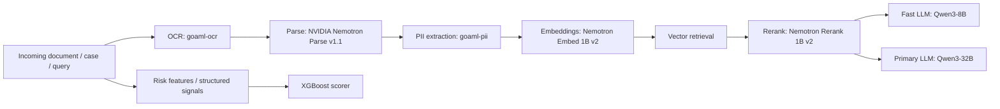
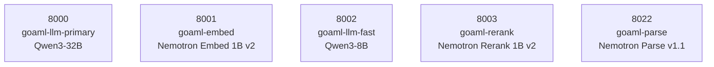

# GPU-01 Running Models

This document summarizes the model-related Docker containers currently running on `ze@gpu-01` as observed on **April 10, 2026** from `docker ps`.

## Overview

The GPU host is running a mix of:

- General-purpose LLMs for reasoning and text generation
- Embedding and reranking models for retrieval
- Document parsing and OCR services
- Specialized wrapper services for PII extraction and scoring

All observed containers were healthy at the time of inspection.

## Confirmed Runtime Inventory

| Container | Model / Service | Served Name | Port | Runtime | Main Role |
|---|---|---|---:|---|---|
| `goaml-llm-primary` | `Qwen/Qwen3-32B-FP8` | `Qwen3-32B` | `8000` | vLLM | Primary reasoning and long-form generation |
| `goaml-llm-fast` | `Qwen/Qwen3-8B-FP8` | `qwen3-8b-instruct` | `8002` | vLLM | Faster low-latency chat and classification |
| `goaml-embed` | `nvidia/llama-nemotron-embed-1b-v2` | `llama-nemotron-embed-1b-v2` | `8001` | vLLM pooling | Embeddings for semantic search and retrieval |
| `goaml-rerank` | `nvidia/llama-nemotron-rerank-1b-v2` | `llama-nemotron-rerank-1b-v2` | `8003` | vLLM pooling | Reranks retrieved results by relevance |
| `goaml-parse` | `nvidia/NVIDIA-Nemotron-Parse-v1.1` | `nemotron-parse` | `8022` | vLLM | Structured parsing from document/image inputs |
| `goaml-ocr` | Image `nemotron-ocr-nemotron-ocr` | Not exposed in `docker ps` | N/A | FastAPI wrapper | OCR service for document text extraction |
| `goaml-pii` | Image `gliner-pii-gliner-pii` | Not exposed in `docker ps` | N/A | FastAPI wrapper | PII/entity extraction service |
| `goaml-scorer` | Image `xgboost-scorer-xgboost-scorer` | Not exposed in `docker ps` | N/A | FastAPI wrapper | Tabular risk scoring service |

## What Each Model Does

### 1. Qwen3-32B (`goaml-llm-primary`)

This is the heavyweight reasoning model on the box. It is the best fit for tasks that need:

- More accurate multi-step reasoning
- Better narrative generation
- Complex case analysis
- Longer context handling than smaller models

In the AML platform, this is the natural candidate for things like SAR drafting, investigative summaries, and higher-stakes analyst workflows.

### 2. Qwen3-8B (`goaml-llm-fast`)

This is the faster and cheaper companion model. It trades some reasoning depth for latency and throughput, which makes it useful for:

- Quick classification
- Prompt routing
- Lightweight summarization
- First-pass triage

A common architecture is to let this model handle routine requests while reserving the 32B model for harder tasks.

### 3. Nemotron Embed 1B v2 (`goaml-embed`)

This model converts text into vectors so that the system can perform semantic retrieval instead of exact keyword matching. It is useful for:

- Document search
- Entity/profile similarity
- Retrieval-augmented generation pipelines
- Nearest-neighbor matching in a vector database

This is usually the first stage of a retrieval stack.

### 4. Nemotron Rerank 1B v2 (`goaml-rerank`)

This model takes an initial set of retrieved candidates and sorts them by relevance. It improves precision after embedding-based retrieval by answering the question: "Which of these results best matches the query?"

Typical use cases:

- Search result refinement
- Passage ranking
- Evidence selection for agent workflows
- Improving context quality before sending data into an LLM

### 5. NVIDIA Nemotron Parse v1.1 (`goaml-parse`)

This model is designed to transform documents into structured information. Since it is launched with image limits enabled, it appears intended for document-style inputs rather than plain text alone.

Typical uses:

- Parsing reports, forms, and statements
- Converting visually structured documents into machine-readable outputs
- Extracting sections, fields, and layout-aware content

This fits naturally after OCR in a document ingestion pipeline.

### 6. OCR Service (`goaml-ocr`)

`docker ps` confirms the OCR service is running, but the exact internal model name is not shown in the command line. Based on the image naming, this is an OCR-focused wrapper service intended to:

- Read scanned or image-based documents
- Extract text before downstream parsing
- Feed structured extraction pipelines

### 7. PII Service (`goaml-pii`)

This service appears to be a GLiNER-based PII extraction wrapper. Its role is likely:

- Detecting names, IDs, addresses, accounts, and other sensitive fields
- Supporting redaction or compliance workflows
- Enriching extracted text with entity tags

### 8. XGBoost Scorer (`goaml-scorer`)

This is a traditional ML scoring service rather than a generative model. It is probably used for:

- Transaction risk scoring
- Rule-plus-ML fraud/AML signals
- Fast tabular inference with predictable latency

This complements the LLM stack rather than replacing it.

## How These Services Fit Together

## Port Map

Only the vLLM-served containers clearly exposed ports in the inspected startup commands.

## Recommended Mental Model

If you want to think about the stack quickly, it breaks down like this:

- `Qwen3-32B`: best reasoning quality
- `Qwen3-8B`: fast general-purpose inference
- `embed + rerank`: retrieval quality layer
- `ocr + parse`: document understanding layer
- `pii`: compliance and sensitive-data extraction
- `xgboost`: structured risk scoring

## Notes

- The exact OCR, PII, and scorer model identifiers were **not fully visible** from `docker ps` alone.
- Those three services are confirmed as running containers, but their underlying model names would need `docker inspect`, image metadata, or container logs to verify precisely.
- The vLLM-backed services were fully identifiable from their launch commands.
