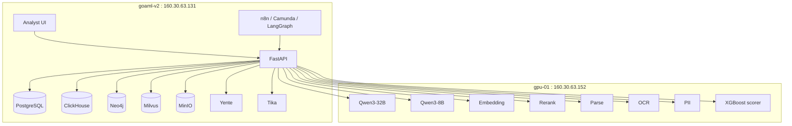
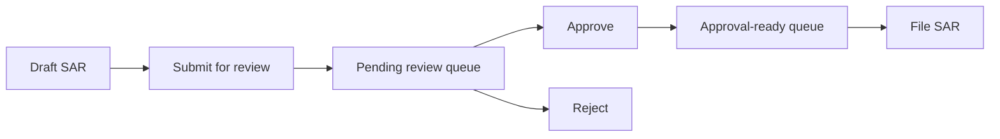
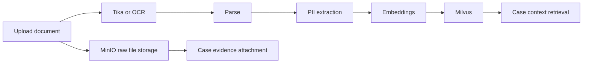

# goAML-v2 Implementation Plan v3

> Detailed implementation guide for the current goAML-v2 build, covering the architecture decisions, deployment structure, step-by-step implementation work completed so far, verification approach, and recommended continuation path, including the live local-auth/profile layer, future WSO2-ready settings surface, the playbook compliance / typology outcome analytics layer, the upgraded team/region playbook hotspot boards, automated playbook enforcement for stuck checklist and evidence-gap intervention, manager-facing tuning of those intervention thresholds from the UI, the management reporting/export layer with scheduled n8n report generation, threshold-based reporting alerts, manager action recommendations, and board-level reporting packs, the new decision-quality analytics plus closed-loop feedback loop across alerts and cases, and the latest maturity implementation slice for analyst productivity, advanced manager controls, workflow exceptions, document/evidence intelligence, entity/network intelligence, and model-tuning governance handoff.

## 1. Purpose

This document is the implementation companion to [goaml-v2-project-overview-v3.md](/Users/ze/Documents/goaml-v2/goaml-v2-project-overview-v3.md).

The documentation set for ongoing maintenance now also includes:

- [end-user-manual.md](/Users/ze/Documents/goaml-v2/end-user-manual.md)
- [product-feature-document.md](/Users/ze/Documents/goaml-v2/product-feature-document.md)
- [admin-manual.md](/Users/ze/Documents/goaml-v2/admin-manual.md)
- [platform-functional-features.md](/Users/ze/Documents/goaml-v2/platform-functional-features.md)

It answers a different question:

- the overview explains what the platform is
- this guide explains what was implemented, in what order, where the code lives, how it was deployed, and how to continue from the current state

This is meant to help:

- continue feature development without losing context
- redeploy or reproduce the current environment
- onboard a new engineer quickly
- separate completed work from future work

Documentation maintenance rule going forward:

- after each implementation phase, update:
  - [goaml-v2-project-overview-v3.md](/Users/ze/Documents/goaml-v2/goaml-v2-project-overview-v3.md)
  - [implementation-plan-v3.md](/Users/ze/Documents/goaml-v2/implementation-plan-v3.md)
  - [end-user-manual.md](/Users/ze/Documents/goaml-v2/end-user-manual.md)
  - [product-feature-document.md](/Users/ze/Documents/goaml-v2/product-feature-document.md)
  - [admin-manual.md](/Users/ze/Documents/goaml-v2/admin-manual.md)
  - [platform-functional-features.md](/Users/ze/Documents/goaml-v2/platform-functional-features.md)

## 2. Final Architecture We Implemented

The platform is now a two-plane deployment:

- app/control plane on `goaml-v2` at `160.30.63.131`
- inference/model plane on `gpu-01` at `160.30.63.152`

The key design decision was to keep those two servers separated and integrate them only through HTTP APIs.



## 3. Environments and Source of Truth

### 3.1 Remote Hosts

- App host: `ze@goaml-v2`
- App IP: `160.30.63.131`
- App root: `/home/ze/goaml-v2`

- GPU host: `ze@gpu-01`
- GPU IP: `160.30.63.152`
- Model deployment root: model-specific directories on the GPU host

### 3.2 Local Mirrors

- App-side deployment copy: [remote-goaml-v2-install](/Users/ze/Documents/goaml-v2/remote-goaml-v2-install)
- GPU-side deployment copy: [remote-gpu-01-models](/Users/ze/Documents/goaml-v2/remote-gpu-01-models)
- Current architecture/feature overview: [goaml-v2-project-overview-v3.md](/Users/ze/Documents/goaml-v2/goaml-v2-project-overview-v3.md)

### 3.3 Main Code Areas

Backend API routes:

- [auth.py](/Users/ze/Documents/goaml-v2/remote-goaml-v2-install/app-layer/app/api/v1/auth.py)
- [alerts.py](/Users/ze/Documents/goaml-v2/remote-goaml-v2-install/app-layer/app/api/v1/alerts.py)
- [analyst.py](/Users/ze/Documents/goaml-v2/remote-goaml-v2-install/app-layer/app/api/v1/analyst.py)
- [cases.py](/Users/ze/Documents/goaml-v2/remote-goaml-v2-install/app-layer/app/api/v1/cases.py)
- [documents.py](/Users/ze/Documents/goaml-v2/remote-goaml-v2-install/app-layer/app/api/v1/documents.py)
- [entities.py](/Users/ze/Documents/goaml-v2/remote-goaml-v2-install/app-layer/app/api/v1/entities.py)
- [graph.py](/Users/ze/Documents/goaml-v2/remote-goaml-v2-install/app-layer/app/api/v1/graph.py)
- [manager.py](/Users/ze/Documents/goaml-v2/remote-goaml-v2-install/app-layer/app/api/v1/manager.py)
- [model_ops.py](/Users/ze/Documents/goaml-v2/remote-goaml-v2-install/app-layer/app/api/v1/model_ops.py)
- [screening.py](/Users/ze/Documents/goaml-v2/remote-goaml-v2-install/app-layer/app/api/v1/screening.py)
- [transactions.py](/Users/ze/Documents/goaml-v2/remote-goaml-v2-install/app-layer/app/api/v1/transactions.py)
- [views.py](/Users/ze/Documents/goaml-v2/remote-goaml-v2-install/app-layer/app/api/v1/views.py)
- [workflows.py](/Users/ze/Documents/goaml-v2/remote-goaml-v2-install/app-layer/app/api/v1/workflows.py)

Backend services:

- [auth.py](/Users/ze/Documents/goaml-v2/remote-goaml-v2-install/app-layer/app/services/auth.py)
- [analyst_context.py](/Users/ze/Documents/goaml-v2/remote-goaml-v2-install/app-layer/app/services/analyst_context.py)
- [alerts.py](/Users/ze/Documents/goaml-v2/remote-goaml-v2-install/app-layer/app/services/alerts.py)
- [cases.py](/Users/ze/Documents/goaml-v2/remote-goaml-v2-install/app-layer/app/services/cases.py)
- [case_context.py](/Users/ze/Documents/goaml-v2/remote-goaml-v2-install/app-layer/app/services/case_context.py)
- [case_summary.py](/Users/ze/Documents/goaml-v2/remote-goaml-v2-install/app-layer/app/services/case_summary.py)
- [case_workspace.py](/Users/ze/Documents/goaml-v2/remote-goaml-v2-install/app-layer/app/services/case_workspace.py)
- [documents.py](/Users/ze/Documents/goaml-v2/remote-goaml-v2-install/app-layer/app/services/documents.py)
- [entities.py](/Users/ze/Documents/goaml-v2/remote-goaml-v2-install/app-layer/app/services/entities.py)
- [graph.py](/Users/ze/Documents/goaml-v2/remote-goaml-v2-install/app-layer/app/services/graph.py)
- [graph_sync.py](/Users/ze/Documents/goaml-v2/remote-goaml-v2-install/app-layer/app/services/graph_sync.py)
- [model_registry.py](/Users/ze/Documents/goaml-v2/remote-goaml-v2-install/app-layer/app/services/model_registry.py)
- [notification_center.py](/Users/ze/Documents/goaml-v2/remote-goaml-v2-install/app-layer/app/services/notification_center.py)
- [playbook_analytics.py](/Users/ze/Documents/goaml-v2/remote-goaml-v2-install/app-layer/app/services/playbook_analytics.py)
- [saved_views.py](/Users/ze/Documents/goaml-v2/remote-goaml-v2-install/app-layer/app/services/saved_views.py)
- [screening.py](/Users/ze/Documents/goaml-v2/remote-goaml-v2-install/app-layer/app/services/screening.py)
- [scorer.py](/Users/ze/Documents/goaml-v2/remote-goaml-v2-install/app-layer/app/services/scorer.py)
- [sla_analytics.py](/Users/ze/Documents/goaml-v2/remote-goaml-v2-install/app-layer/app/services/sla_analytics.py)
- [transaction_db.py](/Users/ze/Documents/goaml-v2/remote-goaml-v2-install/app-layer/app/services/transaction_db.py)
- [workflow_engine.py](/Users/ze/Documents/goaml-v2/remote-goaml-v2-install/app-layer/app/services/workflow_engine.py)
- [maturity_features.py](/Users/ze/Documents/goaml-v2/remote-goaml-v2-install/app-layer/app/services/maturity_features.py)

## 3.4 Latest Implementation Slice

The newest completed feature wave widened six maturity areas without waiting for v3-style row-level partitioning:

- analyst productivity:
  - alert and SAR bulk-action previews
  - queue next/previous navigation
  - action note templates
  - keyboard shortcuts for `Alert Desk` and `SAR Queue`
- manager control:
  - advanced manager controls
  - saved workspace presets
  - balancing rules
  - intervention suggestions
  - team and region hotspot boards
- workflow orchestration depth:
  - workflow exception inventory
  - guided-state visibility
  - intervention actions from `Workflow Ops`
- document and evidence intelligence:
  - duplicate candidates
  - related-document surfacing
  - provenance trails
  - filing-pack impact visibility
- entity and network intelligence:
  - network risk summary
  - watch patterns
  - graph-driven recommendations
- model and decisioning depth:
  - tuning recommendations
  - governance handoff from `Model Ops`

UI:

- [index.html](/Users/ze/Documents/goaml-v2/remote-goaml-v2-install/app-layer/ui/index.html)

Schemas and deployment:

- [schema_postgres.sql](/Users/ze/Documents/goaml-v2/remote-goaml-v2-install/schema_postgres.sql)
- [schema_clickhouse.sql](/Users/ze/Documents/goaml-v2/remote-goaml-v2-install/schema_clickhouse.sql)
- [docker-compose.app.yml](/Users/ze/Documents/goaml-v2/remote-goaml-v2-install/app-layer/docker-compose.app.yml)
- [docker-compose.agent.yml](/Users/ze/Documents/goaml-v2/remote-goaml-v2-install/agent-layer/docker-compose.agent.yml)
- [docker-compose-docs.yml](/Users/ze/Documents/goaml-v2/remote-goaml-v2-install/tike-opensanctions-layer/docker-compose-docs.yml)
- [docker-compose.storage.yml](/Users/ze/Documents/goaml-v2/remote-goaml-v2-install/storage-layer/docker-compose.storage.yml)
- [docker-compose.graph.yml](/Users/ze/Documents/goaml-v2/remote-goaml-v2-install/graph-vector-layer/docker-compose.graph.yml)

Seed tooling:

- [seed_aml_dataset.py](/Users/ze/Documents/goaml-v2/remote-goaml-v2-install/app-layer/app/tools/seed_aml_dataset.py)

Workflow automation assets:

- [watchlist_rescreen_daily_due.json](/Users/ze/Documents/goaml-v2/remote-goaml-v2-install/workflow-layer/n8n/watchlist_rescreen_daily_due.json)
- [watchlist_rescreen_weekly_full.json](/Users/ze/Documents/goaml-v2/remote-goaml-v2-install/workflow-layer/n8n/watchlist_rescreen_weekly_full.json)
- [sar_queue_rebalance_daily.json](/Users/ze/Documents/goaml-v2/remote-goaml-v2-install/workflow-layer/n8n/sar_queue_rebalance_daily.json)
- [scorer_drift_monitor_daily.json](/Users/ze/Documents/goaml-v2/remote-goaml-v2-install/workflow-layer/n8n/scorer_drift_monitor_daily.json)
- [scorer_challenger_weekly.json](/Users/ze/Documents/goaml-v2/remote-goaml-v2-install/workflow-layer/n8n/scorer_challenger_weekly.json)
- [manager_report_daily_csv.json](/Users/ze/Documents/goaml-v2/remote-goaml-v2-install/workflow-layer/n8n/manager_report_daily_csv.json)
- [executive_report_weekly_pdf.json](/Users/ze/Documents/goaml-v2/remote-goaml-v2-install/workflow-layer/n8n/executive_report_weekly_pdf.json)
- [reporting_alerts_daily.json](/Users/ze/Documents/goaml-v2/remote-goaml-v2-install/workflow-layer/n8n/reporting_alerts_daily.json)
- [report_distribution_monthly.json](/Users/ze/Documents/goaml-v2/remote-goaml-v2-install/workflow-layer/n8n/report_distribution_monthly.json)
- [report_distribution_quarterly.json](/Users/ze/Documents/goaml-v2/remote-goaml-v2-install/workflow-layer/n8n/report_distribution_quarterly.json)
- [install_watchlist_rescreen_n8n.sh](/Users/ze/Documents/goaml-v2/remote-goaml-v2-install/workflow-layer/scripts/install_watchlist_rescreen_n8n.sh)
- [install_sar_queue_rebalance_n8n.sh](/Users/ze/Documents/goaml-v2/remote-goaml-v2-install/workflow-layer/scripts/install_sar_queue_rebalance_n8n.sh)
- [install_model_monitoring_n8n.sh](/Users/ze/Documents/goaml-v2/remote-goaml-v2-install/workflow-layer/scripts/install_model_monitoring_n8n.sh)
- [install_management_reports_n8n.sh](/Users/ze/Documents/goaml-v2/remote-goaml-v2-install/workflow-layer/scripts/install_management_reports_n8n.sh)

GPU model deployment copies:

- [Qwen3-32B-FP8/docker-compose.yml](/Users/ze/Documents/goaml-v2/remote-gpu-01-models/Qwen3-32B-FP8/docker-compose.yml)
- [qwen3-8b/docker-compose.yml](/Users/ze/Documents/goaml-v2/remote-gpu-01-models/qwen3-8b/docker-compose.yml)
- [nemotron-embed-1b/docker-compose.yml](/Users/ze/Documents/goaml-v2/remote-gpu-01-models/nemotron-embed-1b/docker-compose.yml)
- [nemotron-rerank-1b/docker-compose.yml](/Users/ze/Documents/goaml-v2/remote-gpu-01-models/nemotron-rerank-1b/docker-compose.yml)
- [nemotron-parse/docker-compose.yml](/Users/ze/Documents/goaml-v2/remote-gpu-01-models/nemotron-parse/docker-compose.yml)
- [nemotron-ocr/docker-compose.yml](/Users/ze/Documents/goaml-v2/remote-gpu-01-models/nemotron-ocr/docker-compose.yml)
- [gliner-pii/docker-compose.yml](/Users/ze/Documents/goaml-v2/remote-gpu-01-models/gliner-pii/docker-compose.yml)
- [xgboost-scorer/docker-compose.yml](/Users/ze/Documents/goaml-v2/remote-gpu-01-models/xgboost-scorer/docker-compose.yml)

## 4. Implementation Sequence Completed So Far

This is the actual build sequence, grouped into practical phases.

### Step 1. Discover the deployed environment

What was done:

- SSH access was used to inspect both `goaml-v2` and `gpu-01`
- `docker ps` was used to inventory live containers
- PostgreSQL was inspected from inside the running container
- the project repo and deployment folders were copied locally for analysis

Why this mattered:

- it established the real system state rather than relying on stale docs
- it proved the platform was already beyond planning
- it revealed the app/model split clearly

Main findings:

- `goaml-v2` runs the product, storage, workflow, graph/vector, and admin stack
- `gpu-01` runs the LLM, OCR, parse, rerank, embedding, PII, and scoring services
- the app config was behind the live GPU deployment naming

### Step 2. Separate app deployment and model deployment

What was done:

- copied `/home/ze/goaml-v2` locally into [remote-goaml-v2-install](/Users/ze/Documents/goaml-v2/remote-goaml-v2-install)
- copied GPU-side model deployment files locally into [remote-gpu-01-models](/Users/ze/Documents/goaml-v2/remote-gpu-01-models)
- kept those directories separated on purpose

Why this mattered:

- the app server should not own model deployment
- the GPU server should stay dedicated to inference
- future scaling and maintenance become much cleaner with this split

### Step 3. Align app configuration to the real GPU APIs

Problem found:

- the app-side compose files still referenced stale internal names such as old NIM-style service hosts

What was done:

- updated app-side environment mappings to point to `160.30.63.152`
- aligned compose env names with the Python settings surface
- documented the final GPU API map

Final GPU API mapping:

```text
LLM_PRIMARY_URL = http://160.30.63.152:8000/v1
LLM_FAST_URL    = http://160.30.63.152:8002/v1
EMBED_URL       = http://160.30.63.152:8001/v1
RERANK_URL      = http://160.30.63.152:8003/v1
PARSE_URL       = http://160.30.63.152:8022/v1
OCR_URL         = http://160.30.63.152:8021
PII_URL         = http://160.30.63.152:8020
SCORER_URL      = http://160.30.63.152:8010
```

### Step 4. Verify and stabilize the base app deployment

What was done:

- checked health endpoints on `160.30.63.131`
- rebuilt and restarted FastAPI and UI containers as features landed
- restarted Nginx when proxy updates were needed
- verified connectivity from `goaml-v2` to all model APIs on `gpu-01`

Core verification endpoints:

- `http://160.30.63.131/`
- `http://160.30.63.131:8000/health`
- `http://160.30.63.131:8000/api/v1/status`

### Step 5. Extend FastAPI into a working AML backend

Initial focus:

- turn the project from static/mock UI into a functioning backend-driven AML app

Implemented:

- transaction ingestion and listing
- alert list/detail/investigate/update/action workflows
- case list/detail/create/update workflows
- case events/timeline
- SAR draft, preview, review, approve, reject, and file flows
- collaboration notes and tasks
- document intelligence endpoints
- entity workspace endpoints
- graph and screening endpoints

Representative route groups:

```text
/api/v1/transactions
/api/v1/alerts
/api/v1/cases
/api/v1/documents
/api/v1/entities
/api/v1/graph
/api/v1/screen
/api/v1/sars/queue
```

### Step 6. Wire the analyst UI to live APIs

Problem found:

- the HTML UI was largely static and prototype-like

What was done:

- wired transactions, alerts, cases, and screening to live APIs
- added case detail and timeline panels
- added case status and assignee updates
- added alert investigate flow
- added SAR preview and filing controls
- added graph evidence and pathfinding panels
- added document analysis and OCR smoke-test UI
- added direct graph actions from cases, alerts, transactions, and documents
- added first-class reviewer queue and watchlist pages

Result:

- the UI at `http://160.30.63.131/` now operates as a real analyst workspace

### Step 7. Fix sanctions screening without a commercial OpenSanctions token

Problem found:

- `yente` was configured for a commercial manifest but no delivery token existed

What was done:

- switched `yente` to use the built-in public `civic.yml` path
- added graceful app-side fallback behavior
- retained OFAC-style fallback logic in the app for resilience

Result:

- `/api/v1/screen` works without an API key
- screening results now populate the analyst UI and entity workflows

### Step 8. Implement LLM SAR drafting

What was done:

- connected case SAR drafting to `Qwen3-32B`
- kept template fallback behavior for resilience
- stored `ai_drafted` and `ai_model`

Result:

- SAR drafting is no longer template-only
- the system uses the live GPU-hosted LLM for narrative generation

### Step 9. Implement case event history and collaboration

What was done:

- added case event timeline endpoint
- added note creation and listing
- added case task creation, listing, and updates
- wrote timeline events for major case actions

Result:

- analysts can see the investigation history
- collaboration artifacts are persisted, not just visible in the UI

### Step 10. Implement SAR review and approval lifecycle

What was done:

- moved SARs beyond simple draft/file behavior
- added review, approve, reject, and file operations
- added queue-oriented APIs for reviewer/approver work
- surfaced those queues as first-class UI pages

Workflow now implemented:



### Step 11. Build retrieval-backed case context

What was done:

- embedded case-related text and queried Milvus
- reranked document candidates through the rerank model
- merged alerts, transactions, screening hits, documents, and graph evidence into one context response
- exposed that context through the case API

Result:

- the case workspace now has a real evidence assembly layer
- retrieval is no longer separate from the investigation surface

### Step 12. Add AI case summaries

What was done:

- used `Qwen3-32B` to summarize investigation evidence for a case
- stored the generated summary and risk factors back onto the case
- added UI controls to trigger and display the summary

Result:

- cases now support both analyst-authored notes and LLM-generated summaries

### Step 13. Implement document intelligence end to end

What was done:

- added document analyze endpoints
- supported image-based OCR path
- passed documents through parse, PII extraction, embeddings, and vector indexing
- stored analyzed records in PostgreSQL
- stored raw files in MinIO
- allowed direct case upload and attachment

Document pipeline now implemented:



### Step 14. Make OCR truly GPU-backed

Problem found:

- the OCR container was falling back because CUDA visibility was misconfigured

What was done:

- fixed the OCR compose setup
- removed the wrong CUDA device masking behavior
- redeployed the OCR service on `gpu-01`

Result:

- OCR health now reports CUDA mode
- image-based document ingestion is using GPU-backed OCR

### Step 15. Add routed workflow ops, notifications, and formal orchestration

What was done:

- added analyst team / region-aware routing metadata for cases, alerts, SAR queues, and watchlist workflows
- added `notification_events` and `orchestration_runs` support tables in PostgreSQL
- added workflow APIs for:
  - workflow overview
  - n8n dashboard data
  - Camunda dashboard data
  - SLA notification dispatch
- added n8n automations for:
  - daily watchlist due re-screen
  - weekly full watchlist re-screen
  - daily SAR queue rebalance
  - daily SAR SLA notification dispatch
  - daily scorer drift capture plus alert dispatch
  - weekly scorer challenger evaluation plus alert dispatch
- added Camunda BPMN deployments for:
  - `goamlSarFormalReview`
  - `goamlWatchlistEscalation`
- wired SAR review submission and watchlist case creation into Camunda process starts
- added live UI pages for:
  - `Workflow Ops`
  - `n8n Monitor`
  - `Camunda`

Result:

- the analyst UI now exposes live automation and orchestration status
- Camunda now tracks real goAML case-linked processes with routed tasks
- SLA notifications now create auditable notification history even before Slack or SMTP credentials are configured
- n8n is actively scheduled for recurring watchlist and SLA automation, even though manual ad hoc execution is still gated by n8n's own auth model

### Step 16. Implement persistent graph sync into Neo4j

What was done:

- created a graph synchronization layer from PostgreSQL into Neo4j
- materialized cases, alerts, transactions, accounts, documents, screening hits, and SARs as graph nodes/edges
- added graph sync, graph explore, graph drilldown, and pathfind APIs
- wired graph refresh into write paths

Result:

- graph exploration is no longer an on-demand relational approximation only
- the analyst UI can query persisted graph evidence and paths

### Step 17. Build graph-driven analyst workflows

What was done:

- added node drilldown
- added case-centric pathfinding
- added direct graph launch from alerts and transactions
- added clickable graph evidence from case and document flows

Result:

- graph reasoning is now part of everyday investigation workflows

### Step 18. Seed dense AML data for realistic testing

What was done:

- built and used a seed script that refreshes synthetic data by seed tag
- seeded accounts, entities, transactions, alerts, cases, documents, screening hits, and SARs
- extended the seed to include watchlist entities and open review cases
- kept the refresh logic safe by replacing only prior rows from the same seed tag

Latest verified seed state:

- accounts: `60`
- entities: `48`
- transactions: `756`
- alerts: `160`
- cases: `42`
- documents: `108`
- screening results: `120`
- SARs: `16`
- persisted Neo4j graph: `1365` nodes and `3251` edges

### Step 19. Implement entity profile, watchlist, and merge workflows

What was done:

- added entity profile API and UI workspace
- added watchlist confirmation and removal actions
- added PEP and sanctions confirmation actions
- added create/reuse watchlist case flow
- added entity note and resolution history
- added duplicate candidate review and merge workflow
- consolidated linked records during merge

Result:

- entity resolution is now a first-class analyst activity, not just a side effect of screening

### Step 20. Add dedicated reviewer and watchlist dashboards

What was done:

- added dedicated SAR review and approval queue endpoints
- added dedicated SAR review queue UI page
- added dedicated watchlist dashboard endpoint
- added dedicated watchlist dashboard UI page
- added open-case counts and links from the watchlist dashboard

Result:

- SAR work queues are first-class instead of hidden inside the case panel
- watchlist entities and watchlist review cases are visible in one place

### Step 21. Finish the Case Command Center

What was done:

- made the Case Command Center the default case-open path across case-linked flows
- added case workspace aggregation on the backend:
  - `GET /api/v1/cases/{id}/workspace`
  - `GET /api/v1/cases/{id}/workflow`
  - `GET /api/v1/cases/{id}/filing-readiness`
- added normalized pinned evidence support:
  - `GET /api/v1/cases/{id}/evidence`
  - `POST /api/v1/cases/{id}/evidence/pin`
  - `PATCH /api/v1/cases/{id}/evidence/{evidence_id}`
  - `DELETE /api/v1/cases/{id}/evidence/{evidence_id}`
- added SAR draft editing:
  - `PATCH /api/v1/cases/{id}/sar`
- added a tabbed case workspace in the UI:
  - `Overview`
  - `Evidence`
  - `Graph`
  - `Documents`
  - `Timeline`
  - `SAR`
- added filing-readiness actions that jump analysts to the relevant tab
- added evidence pinning from alerts, transactions, documents, screening hits, and graph relationships
- added reviewer-grade SAR editing, evidence-in-filing view, and narrative comparison
- added case-specific workflow details in the right rail:
  - expected role
  - process history
  - latest automation touches
  - deeplinked notifications
  - direct links to Workflow Ops, n8n, and Camunda
- added hash/deeplink routing for `/#case-command?case=...`

Result:

- the case workspace now behaves like a unified investigation cockpit instead of a long prototype page
- reviewers and approvers can work from the same screen as analysts without losing workflow context
- the deployed UI and backend now match the intended Command Center design closely enough to treat it as the primary case workspace

### Step 22. Export Filing Packs as Analyst Artifacts

What was done:

- extended filing-pack generation so it can be exported directly from the API and Command Center UI
- added backend export rendering in:
  - `JSON`
  - `PDF`
  - `DOCX`
- added `GET /api/v1/cases/{id}/filing-pack/export`
- added export helpers for:
  - attachment filename generation
  - JSON-safe payload encoding
  - PDF rendering
  - DOCX rendering
- added Command Center actions:
  - `Download JSON`
  - `Download PDF`
  - `Download DOCX`
- kept export payloads grounded on the same filing-pack content already used in the case workflow

Result:

- analysts can now download a portable filing artifact directly from the case workspace instead of relying only on in-browser review
- the export flow supports structured machine-readable output (`JSON`) and human-friendly review/distribution formats (`PDF` and `DOCX`)
- the downloadable artifact preserves the same evidence pack, workflow context, and collaboration context used inside the Command Center

### Step 23. Add Local Auth, RBAC, and WSO2-Ready Settings

What was done:

- added local auth, self-service profile, and RBAC foundation in:
  - [security.py](/Users/ze/Documents/goaml-v2/remote-goaml-v2-install/app-layer/app/core/security.py)
  - [auth.py](/Users/ze/Documents/goaml-v2/remote-goaml-v2-install/app-layer/app/services/auth.py)
  - [auth.py](/Users/ze/Documents/goaml-v2/remote-goaml-v2-install/app-layer/app/api/v1/auth.py)
  - [auth.py](/Users/ze/Documents/goaml-v2/remote-goaml-v2-install/app-layer/app/models/auth.py)
- extended settings/config to support:
  - local password auth
  - JWT sessions
  - future WSO2 / OIDC provider metadata
- created persistent auth tables in PostgreSQL:
  - `auth_roles`
  - `app_users`
  - `auth_provider_settings`
  - `auth_audit_events`
- seeded local roles:
  - `analyst`
  - `reviewer`
  - `approver`
  - `manager`
  - `sanctions_analyst`
  - `model_ops`
  - `workflow_ops`
  - `auditor`
  - `admin`
- seeded local bootstrap users:
  - `analyst1`
  - `reviewer1`
  - `approver1`
  - `manager1`
  - `sanctions1`
  - `modelops1`
  - `workflowops1`
  - `auditor1`
  - `admin1`
- used a shared bootstrap password from config for the demo seed:
  - `Goaml!2026`
- added live auth and profile endpoints:
  - `POST /api/v1/auth/login`
  - `POST /api/v1/auth/logout`
  - `GET /api/v1/auth/me`
  - `GET /api/v1/auth/profile`
  - `PATCH /api/v1/auth/profile`
  - `POST /api/v1/auth/change-password`
  - `GET /api/v1/auth/settings`
  - `PUT /api/v1/auth/settings/{provider_key}`
  - `GET /api/v1/auth/roles`
  - `GET /api/v1/auth/users`
  - `POST /api/v1/auth/users`
  - `PATCH /api/v1/auth/users/{username}`
  - `POST /api/v1/auth/users/{username}/reset-password`
  - `GET /api/v1/auth/audit`
- protected business APIs with permission-aware dependencies
- enforced SAR separation-of-duties rules so drafters/reviewers cannot self-approve or self-file the same SAR
- normalized request actors and assignment changes so workflow actions follow the logged-in user rather than free-form client payloads
- added a full-screen login overlay and role-aware app shell in the HTML UI
- added a dedicated `My Profile` page with:
  - editable identity details
  - landing-desk preference
  - self-service password change and logout
- added a `Settings` desk with:
  - current session summary
  - change-my-password flow
  - local auth provider settings
  - WSO2 / OIDC provider forms kept ready for future activation
  - local user and role administration
  - auth audit visibility
- added desk-level UI gating so each role sees only the desks it is allowed to open

Result:

- the analyst product no longer depends on anonymous access
- role-aware desk visibility, protected APIs, and auth audit are now part of the live deployment
- login, logout, self-service profile editing, and landing-desk preference are now part of the public analyst experience
- the product can stay on local auth for now while preserving a clean future migration path to WSO2 or another external identity provider

## 5. Deployment and Update Procedure Used

The normal working pattern used so far has been:

1. edit locally in the copied deployment source
2. compile/syntax-check locally
3. copy only the changed files to the remote app host
4. rebuild only the affected containers
5. verify through public and internal endpoints

### 5.1 Common Local Validation

Python compile check:

```bash
python3 -m py_compile path/to/file.py
```

UI script syntax check:

```bash
node --check /tmp/goaml_ui_check.js
```

### 5.2 Common Remote Copy Pattern

For app-side files:

```bash
tar -C /Users/ze/Documents/goaml-v2/remote-goaml-v2-install/app-layer -cf - app/services/entities.py \
| ssh ze@goaml-v2 'cd /home/ze/goaml-v2/app-layer && tar -xf -'
```

For broader app-layer deploys:

```bash
tar -C /Users/ze/Documents/goaml-v2/remote-goaml-v2-install/app-layer -cf - . \
| ssh ze@goaml-v2 'cd /home/ze/goaml-v2/app-layer && tar -xf -'
```

### 5.3 Common Remote Rebuild Pattern

FastAPI only:

```bash
ssh ze@goaml-v2 'cd /home/ze/goaml-v2/app-layer && docker compose -f docker-compose.app.yml --env-file ../.env.app up -d --build fastapi'
```

FastAPI + UI + Nginx:

```bash
ssh ze@goaml-v2 'cd /home/ze/goaml-v2/app-layer && docker compose -f docker-compose.app.yml --env-file ../.env.app up -d --build fastapi react-ui nginx'
```

If Nginx needed a restart:

```bash
ssh ze@goaml-v2 'docker restart goaml-nginx'
```

### 5.4 GPU-Side Rebuild Pattern

For model-side services such as OCR:

```bash
ssh ze@gpu-01 'cd /path/to/model-folder && docker compose up -d --build'
```

## 6. Verification Checklist Used

### 6.1 Core Platform

- `GET http://160.30.63.131/`
- `GET http://160.30.63.131:8000/health`
- `GET http://160.30.63.131:8000/api/v1/status`

### 6.2 Transactions and Alerts

- `GET /api/v1/transactions`
- `GET /api/v1/alerts`
- `GET /api/v1/alerts/{id}`
- `POST /api/v1/alerts/{id}/investigate`
- `POST /api/v1/alerts/{id}/actions`

### 6.3 Cases and SARs

- `GET /api/v1/cases`
- `GET /api/v1/cases/{id}`
- `GET /api/v1/cases/{id}/events`
- `GET /api/v1/cases/{id}/workspace`
- `GET /api/v1/cases/{id}/workflow`
- `GET /api/v1/cases/{id}/filing-readiness`
- `GET /api/v1/cases/{id}/context`
- `GET /api/v1/cases/{id}/evidence`
- `POST /api/v1/cases/{id}/evidence/pin`
- `PATCH /api/v1/cases/{id}/evidence/{evidence_id}`
- `DELETE /api/v1/cases/{id}/evidence/{evidence_id}`
- `POST /api/v1/cases/{id}/summary`
- `POST /api/v1/cases/{id}/sar`
- `PATCH /api/v1/cases/{id}/sar`
- `POST /api/v1/cases/{id}/sar/review`
- `POST /api/v1/cases/{id}/sar/file`
- `GET /api/v1/sars/queue`

### 6.4 Documents and Intelligence

- `POST /api/v1/documents/analyze`
- `GET /api/v1/documents`
- `GET /api/v1/documents/{id}`
- `POST /api/v1/cases/{id}/documents/analyze`
- `POST /api/v1/cases/{id}/documents/{document_id}/attach`

### 6.5 Entities and Watchlist

- `GET /api/v1/entities`
- `GET /api/v1/entities/watchlist`
- `GET /api/v1/entities/{id}`
- `POST /api/v1/entities/{id}/resolve`

### 6.6 Graph

- `POST /api/v1/graph/explore`
- `POST /api/v1/graph/drilldown`
- `POST /api/v1/graph/pathfind`
- `POST /api/v1/graph/sync`

### 6.7 Screening

- `POST /api/v1/screen`

### 6.8 Model Plane

- `GET http://160.30.63.152:8000/health`
- `GET http://160.30.63.152:8001/health`
- `GET http://160.30.63.152:8002/health`
- `GET http://160.30.63.152:8003/health`
- `GET http://160.30.63.152:8010/health`
- `GET http://160.30.63.152:8020/health`
- `GET http://160.30.63.152:8021/health`
- `GET http://160.30.63.152:8022/health`

## 7. Current Functional Scope

The implemented platform now supports:

- local username/password login with JWT sessions
- self-service user profile and landing-desk preference
- seeded roles, seeded demo users, and auth audit history
- topbar profile/settings/logout controls in the live UI
- role-aware launchpad and desk visibility
- settings-driven local auth administration with future WSO2 / OIDC provider forms
- transaction monitoring and risk scoring
- alert triage, investigation, resolution, and escalation
- case management with timeline history
- a default Case Command Center with case-specific workflow state
- tabbed case review across overview, evidence, graph, documents, timeline, and SAR
- pinned evidence management and filing-readiness scoring
- case collaboration notes and tasks
- retrieval-backed investigation context
- AI case summaries
- LLM SAR drafting
- reviewer-grade SAR editing and narrative comparison
- SAR review, approval, rejection, and filing
- reviewer / approver work queues
- reviewer / approver SLA analytics and workload dashboards
- automated SAR queue rebalancing through n8n
- sanctions screening without a commercial token
- document OCR, parse, PII extraction, embedding, and vector indexing
- MinIO-backed raw document storage
- direct case evidence upload and attachment
- persisted Neo4j graph sync, drilldown, and pathfinding
- entity resolution, watchlist workflow, and merge workflow
- watchlist dashboard and review-case visibility
- recurring n8n-driven watchlist re-screen automation
- automatic case escalation and task creation when watchlist re-screening finds new matches
- dense seeded AML data for testing and demos

## 8. Remaining Work After This Implementation

The platform is already useful, but the following are still the main next steps:

### 8.1 Near-Term Engineering Work

- deepen retrieval and rerank in case evidence assembly and summaries
- use pinned evidence directly in AI summary and SAR prompt composition
- expand evidence-pack generation for alerts, cases, and SAR filing outputs
- expand recurring watchlist automation beyond the current re-screen jobs
- drive more workflow actions through n8n, Camunda, and LangGraph
- improve entity resolution confidence and duplicate automation
- expand the live champion/challenger and drift monitoring flow into richer benchmark packs, business-outcome analytics, and model-quality dashboards

### 8.2 Enterprise / Production Hardening

- integrate WSO2 identity as a provider swap on top of the live local auth model
- deepen row-level authorization, step-up auth, and approval policy enforcement
- enable HTTPS and stronger secret handling
- add monitoring, backups, and retention
- load test and security test the system

## 9. Recommended Operating Model Going Forward

For continued development, the safest pattern is:

1. keep app and GPU changes separated
2. edit only in the local mirror first
3. copy targeted files to the remote host
4. rebuild only the affected container
5. verify through live endpoints after each change
6. refresh the seed data when demo workflows drift too far from baseline
7. update the overview and this implementation guide whenever a major workflow changes

## 10. Quick Orientation for a New Engineer

If a new engineer joins today, tell them this:

- the system is already deployed and usable
- the app host is `goaml-v2`
- the model host is `gpu-01`
- FastAPI and the HTML analyst UI are already wired together
- local auth and RBAC are already live, including a seeded demo user set and a WSO2-ready settings desk
- the Case Command Center is now the default case workspace
- graph, document intelligence, entity workflows, and SAR queues are live
- the XGBoost scorer is live in the transaction path, and MLflow is now the runtime source of truth for scorer registration, promotion, and deployment
- the `Model Ops` page exposes scorer runtime metadata, registry versions, deployment alignment, approval workflow, champion/challenger evaluation, drift monitoring, and scorer business impact boards that surface version-level alert capture, false-positive posture, case conversion, SAR conversion, filed-SAR rate, case cycle time, and dominant typology
- scorer drift capture, challenger evaluation, and model-monitoring alert dispatch are now scheduled through n8n and visible in `Workflow Ops`
- Reporting Studio now includes executive KPI reporting, monthly operational summaries, typology mix, watchlist/screening posture, model/workflow health, team/region playbook trends, playbook effectiveness, manager false-positive reporting, filed SAR volume, backlog aging, persisted daily/weekly/monthly reporting snapshots, period-over-period movement boards, executive drilldowns with direct desk jumps, threshold-based reporting alerts, manager action recommendations, board-level summaries, scheduled distribution rules, a compliance oversight layer, an outcome-correlation layer, and workflow effectiveness analytics for SAR rebalance, playbook automation, and watchlist re-screen flows
- Reporting Studio now also includes decision-quality drilldowns by typology, team, region, and feedback signal, so managers can move from quality metrics directly into the affected case set
- Workflow Ops now includes feedback-to-action automation for noisy-alert hotspots, weak SAR draft interventions, and missing-evidence follow-up tasks driven by closed-loop analyst feedback
- Reporting Studio now also includes quality-tuning recommendations plus reviewer-quality analytics for drafter rejection/rework posture and approval-to-filing lag by team and typology
- Reporting Studio now also includes persisted decision-quality snapshot history and period-over-period quality movement so management can review quality posture historically, not only live
- Workflow Ops now also includes quality recommendation automation for recurring noisy typologies and repeated drafter-quality hotspots detected across historical quality snapshots
- management reports can now be exported in branded `JSON`, `CSV`, `PDF`, and `DOCX` packs using `manager`, `executive`, `compliance`, and `board` templates
- historical-period management exports can now be generated from a selected snapshot instead of only the current live window
- recurring report capture and distribution are now scheduled through n8n for daily snapshot capture, daily manager delivery, weekly distribution, daily manager CSV packs, weekly executive PDF packs, daily reporting alerts, monthly board PDF packs, and quarterly board DOCX packs
- the current priority is not basic CRUD anymore
- the current priority is operational depth, ML lifecycle control, orchestration, and enterprise hardening

## 11. Related Documents

- [goaml-v2-project-overview-v3.md](/Users/ze/Documents/goaml-v2/goaml-v2-project-overview-v3.md)
- [goAML-V2-PROJECT-OVERVIEW.md](/Users/ze/Documents/goaml-v2/goAML-V2-PROJECT-OVERVIEW.md)
- [gpu-01-running-models.md](/Users/ze/Documents/goaml-v2/gpu-01-running-models.md)
- [case-command-center-design-spec.md](/Users/ze/Documents/goaml-v2/case-command-center-design-spec.md)
- [case-command-center-implementation-tasks.md](/Users/ze/Documents/goaml-v2/case-command-center-implementation-tasks.md)
