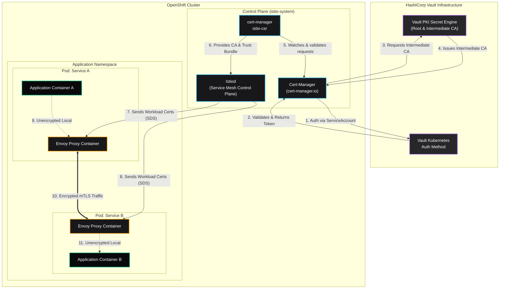

# OpenShift Service Mesh mTLS with HashiCorp Vault Architecture

This diagram illustrates the infrastructure and flow for implementing mutual TLS (mTLS) in OpenShift Service Mesh, backed by HashiCorp Vault as the Certificate Authority (CA).

### Key Components & Flow Details:

1. **HashiCorp Vault**: Acts as the external Root CA and generates the Intermediate CA used by the mesh.
2. **Cert-Manager & Istio-CSR**: `cert-manager` successfully authenticates with Vault (via OpenShift Kubernetes Auth Method). `istio-csr` operates as an agent that proxies Istio's certificate signing requests to `cert-manager`—preventing Istiod from acting as a CA itself.
3. **Istiod**: The control plane component delegates the CA responsibility and focuses purely on pushing the configuration and signed certificates down to the workloads.
4. **Envoy Proxies**: Inside every pod, Envoy requests a certificate via the Secret Discovery Service (SDS) API from Istiod. 
5. **mTLS**: Application containers talk unencrypted locally to their sidecar Envoy over `localhost`, but whenever Envoy sends traffic across the network to another service, it uses the Vault-backed certificates to establish an authenticated, encrypted mTLS tunnel.
